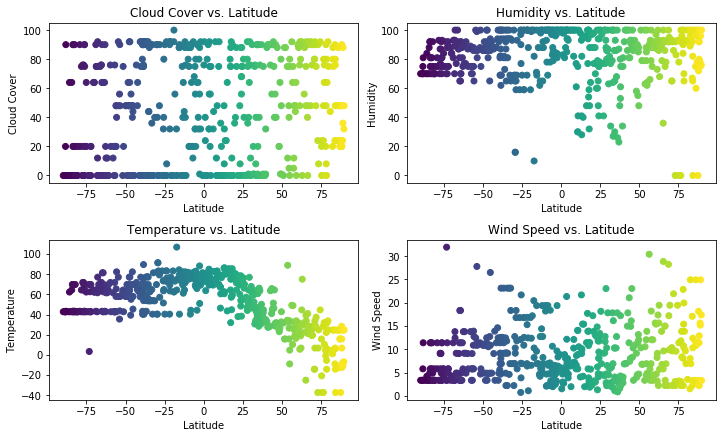

```python
#Dependencies
import json
import requests as req
import numpy as np
import pandas as pd
import matplotlib.pyplot as plt
from citipy import citipy
import random
import time
import re
```


```python
#Set up lists to collect data
cities = []
lats = []
temps = []
humid = []
wind = []
clouds = []
frames = []

```


```python
#Randomly generate lat/lng and collect nearest city
api_key = input("Enter API key ")
for i in range(10):
    lat = np.random.uniform(low=-90.00000, high=90.000000, size = 60)
    lng = np.random.uniform(low=-120.00000, high=120.000000, size = 60)
    print ("Please wait, fetching cities")
    time.sleep(60)
    for j in range(50):
        try:
            city = citipy.nearest_city(lat[j], lng[j])
            city_name = city.city_name
            query = re.sub('\s+','+',city_name.lower())
        #API request
            url = "http://api.openweathermap.org/data/2.5/weather?q=" + query + "&APPID=" + api_key + "&units=imperial"
            response = req.get(url)
            print("Retrieving weather data for " + query)
            print(url)
            response_json = response.json()
        #Collect data from JSON 
            temps.append(response_json["main"]["temp"])
            humid.append(response_json["main"]["humidity"])
            wind.append(response_json["wind"]["speed"])
            clouds.append(response_json["clouds"]["all"])
            cities.append(query)
            lats.append(lat[j])
        except KeyError:
            url = "http://api.openweathermap.org/data/2.5/weather?lat=" + str(lat[j]) + "&lon=" + str(lng[j]) + "&APPID=d77529b69cd743d50d241b93b6553ec5&units=imperial"
            response = req.get(url)
            print("Trying somewhere near that")
            print(url)
            response_json = response.json()
            temps.append(response_json["main"]["temp"])
            humid.append(response_json["main"]["humidity"])
            wind.append(response_json["wind"]["speed"])
            clouds.append(response_json["clouds"]["all"])
            cities.append(query)
            lats.append(lat[j])
            
df = pd.DataFrame(data = {"Cities": cities, "Latitude": lats, "Temperature": temps, "Humidity": humid, "Wind Speed": wind, "Cloud Cover": clouds})
frames.append(df)

        
```

    Enter API key d77529b69cd743d50d241b93b6553ec5
    Please wait, fetching cities
    Retrieving weather data for clyde+river
    http://api.openweathermap.org/data/2.5/weather?q=clyde+river&APPID=d77529b69cd743d50d241b93b6553ec5&units=imperial
    Retrieving weather data for jamestown
    http://api.openweathermap.org/data/2.5/weather?q=jamestown&APPID=d77529b69cd743d50d241b93b6553ec5&units=imperial
    Retrieving weather data for aripuana
    http://api.openweathermap.org/data/2.5/weather?q=aripuana&APPID=d77529b69cd743d50d241b93b6553ec5&units=imperial
    Retrieving weather data for port+alfred
    http://api.openweathermap.org/data/2.5/weather?q=port+alfred&APPID=d77529b69cd743d50d241b93b6553ec5&units=imperial
    Retrieving weather data for port+elizabeth
    http://api.openweathermap.org/data/2.5/weather?q=port+elizabeth&APPID=d77529b69cd743d50d241b93b6553ec5&units=imperial
    Retrieving weather data for busselton
    http://api.openweathermap.org/data/2.5/weather?q=busselton&APPID=d77529b69cd743d50d241b93b6553ec5&units=imperial
    Retrieving weather data for alice+town
    http://api.openweathermap.org/data/2.5/weather?q=alice+town&APPID=d77529b69cd743d50d241b93b6553ec5&units=imperial
    Retrieving weather data for saldanha
    http://api.openweathermap.org/data/2.5/weather?q=saldanha&APPID=d77529b69cd743d50d241b93b6553ec5&units=imperial
    Retrieving weather data for cotonou
    http://api.openweathermap.org/data/2.5/weather?q=cotonou&APPID=d77529b69cd743d50d241b93b6553ec5&units=imperial
    Retrieving weather data for pleasanton
    http://api.openweathermap.org/data/2.5/weather?q=pleasanton&APPID=d77529b69cd743d50d241b93b6553ec5&units=imperial
    Retrieving weather data for ushuaia
    http://api.openweathermap.org/data/2.5/weather?q=ushuaia&APPID=d77529b69cd743d50d241b93b6553ec5&units=imperial
    Retrieving weather data for bathsheba
    http://api.openweathermap.org/data/2.5/weather?q=bathsheba&APPID=d77529b69cd743d50d241b93b6553ec5&units=imperial
    Retrieving weather data for lashio
    http://api.openweathermap.org/data/2.5/weather?q=lashio&APPID=d77529b69cd743d50d241b93b6553ec5&units=imperial
    Retrieving weather data for barentsburg
    http://api.openweathermap.org/data/2.5/weather?q=barentsburg&APPID=d77529b69cd743d50d241b93b6553ec5&units=imperial
    Trying somewhere near that
    http://api.openweathermap.org/data/2.5/weather?lat=85.9228191929&lon=0.0115791223105&APPID=d77529b69cd743d50d241b93b6553ec5&units=imperial
    Retrieving weather data for thompson
    http://api.openweathermap.org/data/2.5/weather?q=thompson&APPID=d77529b69cd743d50d241b93b6553ec5&units=imperial
    Retrieving weather data for azimur
    http://api.openweathermap.org/data/2.5/weather?q=azimur&APPID=d77529b69cd743d50d241b93b6553ec5&units=imperial
    Trying somewhere near that
    http://api.openweathermap.org/data/2.5/weather?lat=33.3395230689&lon=-8.21883751607&APPID=d77529b69cd743d50d241b93b6553ec5&units=imperial
    Retrieving weather data for agadez
    http://api.openweathermap.org/data/2.5/weather?q=agadez&APPID=d77529b69cd743d50d241b93b6553ec5&units=imperial
    Retrieving weather data for palabuhanratu
    http://api.openweathermap.org/data/2.5/weather?q=palabuhanratu&APPID=d77529b69cd743d50d241b93b6553ec5&units=imperial
    Trying somewhere near that
    http://api.openweathermap.org/data/2.5/weather?lat=-17.4674755208&lon=103.838577943&APPID=d77529b69cd743d50d241b93b6553ec5&units=imperial
    Retrieving weather data for novobiryusinskiy
    http://api.openweathermap.org/data/2.5/weather?q=novobiryusinskiy&APPID=d77529b69cd743d50d241b93b6553ec5&units=imperial
    Retrieving weather data for richards+bay
    http://api.openweathermap.org/data/2.5/weather?q=richards+bay&APPID=d77529b69cd743d50d241b93b6553ec5&units=imperial
    Retrieving weather data for port+blair
    http://api.openweathermap.org/data/2.5/weather?q=port+blair&APPID=d77529b69cd743d50d241b93b6553ec5&units=imperial
    Retrieving weather data for ushuaia
    http://api.openweathermap.org/data/2.5/weather?q=ushuaia&APPID=d77529b69cd743d50d241b93b6553ec5&units=imperial
    Retrieving weather data for palabuhanratu
    http://api.openweathermap.org/data/2.5/weather?q=palabuhanratu&APPID=d77529b69cd743d50d241b93b6553ec5&units=imperial
    Trying somewhere near that
    http://api.openweathermap.org/data/2.5/weather?lat=-12.5089491174&lon=101.672956796&APPID=d77529b69cd743d50d241b93b6553ec5&units=imperial
    Retrieving weather data for talcahuano
    http://api.openweathermap.org/data/2.5/weather?q=talcahuano&APPID=d77529b69cd743d50d241b93b6553ec5&units=imperial
    Retrieving weather data for uhlove
    http://api.openweathermap.org/data/2.5/weather?q=uhlove&APPID=d77529b69cd743d50d241b93b6553ec5&units=imperial
    Retrieving weather data for mar+del+plata
    http://api.openweathermap.org/data/2.5/weather?q=mar+del+plata&APPID=d77529b69cd743d50d241b93b6553ec5&units=imperial
    Retrieving weather data for punta+arenas
    http://api.openweathermap.org/data/2.5/weather?q=punta+arenas&APPID=d77529b69cd743d50d241b93b6553ec5&units=imperial
    Retrieving weather data for tasiilaq
    http://api.openweathermap.org/data/2.5/weather?q=tasiilaq&APPID=d77529b69cd743d50d241b93b6553ec5&units=imperial
    Retrieving weather data for sainte-rose
    http://api.openweathermap.org/data/2.5/weather?q=sainte-rose&APPID=d77529b69cd743d50d241b93b6553ec5&units=imperial
    Retrieving weather data for port+alfred
    http://api.openweathermap.org/data/2.5/weather?q=port+alfred&APPID=d77529b69cd743d50d241b93b6553ec5&units=imperial
    Retrieving weather data for methoni
    http://api.openweathermap.org/data/2.5/weather?q=methoni&APPID=d77529b69cd743d50d241b93b6553ec5&units=imperial
    Retrieving weather data for illoqqortoormiut
    http://api.openweathermap.org/data/2.5/weather?q=illoqqortoormiut&APPID=d77529b69cd743d50d241b93b6553ec5&units=imperial
    Trying somewhere near that
    http://api.openweathermap.org/data/2.5/weather?lat=78.4787646965&lon=-15.5251967245&APPID=d77529b69cd743d50d241b93b6553ec5&units=imperial
    Retrieving weather data for cap+malheureux
    http://api.openweathermap.org/data/2.5/weather?q=cap+malheureux&APPID=d77529b69cd743d50d241b93b6553ec5&units=imperial
    Retrieving weather data for saldanha
    http://api.openweathermap.org/data/2.5/weather?q=saldanha&APPID=d77529b69cd743d50d241b93b6553ec5&units=imperial
    Retrieving weather data for cidreira
    http://api.openweathermap.org/data/2.5/weather?q=cidreira&APPID=d77529b69cd743d50d241b93b6553ec5&units=imperial
    Retrieving weather data for hithadhoo
    http://api.openweathermap.org/data/2.5/weather?q=hithadhoo&APPID=d77529b69cd743d50d241b93b6553ec5&units=imperial
    Retrieving weather data for ushuaia
    http://api.openweathermap.org/data/2.5/weather?q=ushuaia&APPID=d77529b69cd743d50d241b93b6553ec5&units=imperial
    Retrieving weather data for san+cristobal
    http://api.openweathermap.org/data/2.5/weather?q=san+cristobal&APPID=d77529b69cd743d50d241b93b6553ec5&units=imperial
    Retrieving weather data for calabozo
    http://api.openweathermap.org/data/2.5/weather?q=calabozo&APPID=d77529b69cd743d50d241b93b6553ec5&units=imperial
    Retrieving weather data for maceio
    http://api.openweathermap.org/data/2.5/weather?q=maceio&APPID=d77529b69cd743d50d241b93b6553ec5&units=imperial
    Retrieving weather data for bahia+honda
    http://api.openweathermap.org/data/2.5/weather?q=bahia+honda&APPID=d77529b69cd743d50d241b93b6553ec5&units=imperial
    Retrieving weather data for carnarvon
    http://api.openweathermap.org/data/2.5/weather?q=carnarvon&APPID=d77529b69cd743d50d241b93b6553ec5&units=imperial
    Retrieving weather data for hermanus
    http://api.openweathermap.org/data/2.5/weather?q=hermanus&APPID=d77529b69cd743d50d241b93b6553ec5&units=imperial
    Retrieving weather data for taolanaro
    http://api.openweathermap.org/data/2.5/weather?q=taolanaro&APPID=d77529b69cd743d50d241b93b6553ec5&units=imperial
    Trying somewhere near that
    http://api.openweathermap.org/data/2.5/weather?lat=-45.2673168764&lon=57.7284935439&APPID=d77529b69cd743d50d241b93b6553ec5&units=imperial
    Retrieving weather data for jamestown
    http://api.openweathermap.org/data/2.5/weather?q=jamestown&APPID=d77529b69cd743d50d241b93b6553ec5&units=imperial
    Retrieving weather data for port+alfred
    http://api.openweathermap.org/data/2.5/weather?q=port+alfred&APPID=d77529b69cd743d50d241b93b6553ec5&units=imperial
    Retrieving weather data for brits
    http://api.openweathermap.org/data/2.5/weather?q=brits&APPID=d77529b69cd743d50d241b93b6553ec5&units=imperial
    Retrieving weather data for carnarvon
    http://api.openweathermap.org/data/2.5/weather?q=carnarvon&APPID=d77529b69cd743d50d241b93b6553ec5&units=imperial
    Retrieving weather data for la+ronge
    http://api.openweathermap.org/data/2.5/weather?q=la+ronge&APPID=d77529b69cd743d50d241b93b6553ec5&units=imperial
    Retrieving weather data for busselton
    http://api.openweathermap.org/data/2.5/weather?q=busselton&APPID=d77529b69cd743d50d241b93b6553ec5&units=imperial
    Please wait, fetching cities
    Retrieving weather data for caravelas
    http://api.openweathermap.org/data/2.5/weather?q=caravelas&APPID=d77529b69cd743d50d241b93b6553ec5&units=imperial
    Retrieving weather data for jamestown
    http://api.openweathermap.org/data/2.5/weather?q=jamestown&APPID=d77529b69cd743d50d241b93b6553ec5&units=imperial
    Retrieving weather data for saint-philippe
    http://api.openweathermap.org/data/2.5/weather?q=saint-philippe&APPID=d77529b69cd743d50d241b93b6553ec5&units=imperial
    Retrieving weather data for visnes
    http://api.openweathermap.org/data/2.5/weather?q=visnes&APPID=d77529b69cd743d50d241b93b6553ec5&units=imperial
    Retrieving weather data for santa+rosa
    http://api.openweathermap.org/data/2.5/weather?q=santa+rosa&APPID=d77529b69cd743d50d241b93b6553ec5&units=imperial
    Retrieving weather data for estevan
    http://api.openweathermap.org/data/2.5/weather?q=estevan&APPID=d77529b69cd743d50d241b93b6553ec5&units=imperial
    Retrieving weather data for nouadhibou
    http://api.openweathermap.org/data/2.5/weather?q=nouadhibou&APPID=d77529b69cd743d50d241b93b6553ec5&units=imperial
    Retrieving weather data for port+alfred
    http://api.openweathermap.org/data/2.5/weather?q=port+alfred&APPID=d77529b69cd743d50d241b93b6553ec5&units=imperial
    Retrieving weather data for qasigiannguit
    http://api.openweathermap.org/data/2.5/weather?q=qasigiannguit&APPID=d77529b69cd743d50d241b93b6553ec5&units=imperial
    Retrieving weather data for bonthe
    http://api.openweathermap.org/data/2.5/weather?q=bonthe&APPID=d77529b69cd743d50d241b93b6553ec5&units=imperial
    Retrieving weather data for saint-philippe
    http://api.openweathermap.org/data/2.5/weather?q=saint-philippe&APPID=d77529b69cd743d50d241b93b6553ec5&units=imperial
    Retrieving weather data for puerto+ayora
    http://api.openweathermap.org/data/2.5/weather?q=puerto+ayora&APPID=d77529b69cd743d50d241b93b6553ec5&units=imperial
    Retrieving weather data for illoqqortoormiut
    http://api.openweathermap.org/data/2.5/weather?q=illoqqortoormiut&APPID=d77529b69cd743d50d241b93b6553ec5&units=imperial
    Trying somewhere near that
    http://api.openweathermap.org/data/2.5/weather?lat=88.7999933183&lon=-24.5074940992&APPID=d77529b69cd743d50d241b93b6553ec5&units=imperial
    Retrieving weather data for belushya+guba
    http://api.openweathermap.org/data/2.5/weather?q=belushya+guba&APPID=d77529b69cd743d50d241b93b6553ec5&units=imperial
    Trying somewhere near that
    http://api.openweathermap.org/data/2.5/weather?lat=80.8367660152&lon=47.6008520234&APPID=d77529b69cd743d50d241b93b6553ec5&units=imperial
    Retrieving weather data for herat
    http://api.openweathermap.org/data/2.5/weather?q=herat&APPID=d77529b69cd743d50d241b93b6553ec5&units=imperial
    Retrieving weather data for punta+arenas
    http://api.openweathermap.org/data/2.5/weather?q=punta+arenas&APPID=d77529b69cd743d50d241b93b6553ec5&units=imperial
    Retrieving weather data for masuguru
    http://api.openweathermap.org/data/2.5/weather?q=masuguru&APPID=d77529b69cd743d50d241b93b6553ec5&units=imperial
    Retrieving weather data for nanortalik
    http://api.openweathermap.org/data/2.5/weather?q=nanortalik&APPID=d77529b69cd743d50d241b93b6553ec5&units=imperial
    Retrieving weather data for sibolga
    http://api.openweathermap.org/data/2.5/weather?q=sibolga&APPID=d77529b69cd743d50d241b93b6553ec5&units=imperial
    Retrieving weather data for bentiu
    http://api.openweathermap.org/data/2.5/weather?q=bentiu&APPID=d77529b69cd743d50d241b93b6553ec5&units=imperial
    Retrieving weather data for ushuaia
    http://api.openweathermap.org/data/2.5/weather?q=ushuaia&APPID=d77529b69cd743d50d241b93b6553ec5&units=imperial
    Retrieving weather data for marsaxlokk
    http://api.openweathermap.org/data/2.5/weather?q=marsaxlokk&APPID=d77529b69cd743d50d241b93b6553ec5&units=imperial
    Retrieving weather data for mar+del+plata
    http://api.openweathermap.org/data/2.5/weather?q=mar+del+plata&APPID=d77529b69cd743d50d241b93b6553ec5&units=imperial
    Retrieving weather data for hithadhoo
    http://api.openweathermap.org/data/2.5/weather?q=hithadhoo&APPID=d77529b69cd743d50d241b93b6553ec5&units=imperial
    Retrieving weather data for mar+del+plata
    http://api.openweathermap.org/data/2.5/weather?q=mar+del+plata&APPID=d77529b69cd743d50d241b93b6553ec5&units=imperial
    Retrieving weather data for esil
    http://api.openweathermap.org/data/2.5/weather?q=esil&APPID=d77529b69cd743d50d241b93b6553ec5&units=imperial
    Retrieving weather data for cape+town
    http://api.openweathermap.org/data/2.5/weather?q=cape+town&APPID=d77529b69cd743d50d241b93b6553ec5&units=imperial
    Retrieving weather data for ponta+delgada
    http://api.openweathermap.org/data/2.5/weather?q=ponta+delgada&APPID=d77529b69cd743d50d241b93b6553ec5&units=imperial
    Retrieving weather data for shahe
    http://api.openweathermap.org/data/2.5/weather?q=shahe&APPID=d77529b69cd743d50d241b93b6553ec5&units=imperial
    Retrieving weather data for saint-francois
    http://api.openweathermap.org/data/2.5/weather?q=saint-francois&APPID=d77529b69cd743d50d241b93b6553ec5&units=imperial
    Retrieving weather data for ushuaia
    http://api.openweathermap.org/data/2.5/weather?q=ushuaia&APPID=d77529b69cd743d50d241b93b6553ec5&units=imperial
    Retrieving weather data for illoqqortoormiut
    http://api.openweathermap.org/data/2.5/weather?q=illoqqortoormiut&APPID=d77529b69cd743d50d241b93b6553ec5&units=imperial
    Trying somewhere near that
    http://api.openweathermap.org/data/2.5/weather?lat=86.2350499413&lon=-31.4327908536&APPID=d77529b69cd743d50d241b93b6553ec5&units=imperial
    Retrieving weather data for cape+town
    http://api.openweathermap.org/data/2.5/weather?q=cape+town&APPID=d77529b69cd743d50d241b93b6553ec5&units=imperial
    Retrieving weather data for bambanglipuro
    http://api.openweathermap.org/data/2.5/weather?q=bambanglipuro&APPID=d77529b69cd743d50d241b93b6553ec5&units=imperial
    Retrieving weather data for upernavik
    http://api.openweathermap.org/data/2.5/weather?q=upernavik&APPID=d77529b69cd743d50d241b93b6553ec5&units=imperial
    Retrieving weather data for albany
    http://api.openweathermap.org/data/2.5/weather?q=albany&APPID=d77529b69cd743d50d241b93b6553ec5&units=imperial
    Retrieving weather data for khatanga
    http://api.openweathermap.org/data/2.5/weather?q=khatanga&APPID=d77529b69cd743d50d241b93b6553ec5&units=imperial
    Retrieving weather data for amderma
    http://api.openweathermap.org/data/2.5/weather?q=amderma&APPID=d77529b69cd743d50d241b93b6553ec5&units=imperial
    Trying somewhere near that
    http://api.openweathermap.org/data/2.5/weather?lat=73.4016859827&lon=58.1296986661&APPID=d77529b69cd743d50d241b93b6553ec5&units=imperial
    Retrieving weather data for sakakah
    http://api.openweathermap.org/data/2.5/weather?q=sakakah&APPID=d77529b69cd743d50d241b93b6553ec5&units=imperial
    Trying somewhere near that
    http://api.openweathermap.org/data/2.5/weather?lat=29.0944455006&lon=39.5148297369&APPID=d77529b69cd743d50d241b93b6553ec5&units=imperial
    Retrieving weather data for hambantota
    http://api.openweathermap.org/data/2.5/weather?q=hambantota&APPID=d77529b69cd743d50d241b93b6553ec5&units=imperial
    Retrieving weather data for rawson
    http://api.openweathermap.org/data/2.5/weather?q=rawson&APPID=d77529b69cd743d50d241b93b6553ec5&units=imperial
    Retrieving weather data for belushya+guba
    http://api.openweathermap.org/data/2.5/weather?q=belushya+guba&APPID=d77529b69cd743d50d241b93b6553ec5&units=imperial
    Trying somewhere near that
    http://api.openweathermap.org/data/2.5/weather?lat=84.1329394749&lon=53.51316291&APPID=d77529b69cd743d50d241b93b6553ec5&units=imperial
    Retrieving weather data for carnarvon
    http://api.openweathermap.org/data/2.5/weather?q=carnarvon&APPID=d77529b69cd743d50d241b93b6553ec5&units=imperial
    Retrieving weather data for rabo+de+peixe
    http://api.openweathermap.org/data/2.5/weather?q=rabo+de+peixe&APPID=d77529b69cd743d50d241b93b6553ec5&units=imperial
    Retrieving weather data for yellowknife
    http://api.openweathermap.org/data/2.5/weather?q=yellowknife&APPID=d77529b69cd743d50d241b93b6553ec5&units=imperial
    Retrieving weather data for chuy
    http://api.openweathermap.org/data/2.5/weather?q=chuy&APPID=d77529b69cd743d50d241b93b6553ec5&units=imperial
    Retrieving weather data for illoqqortoormiut
    http://api.openweathermap.org/data/2.5/weather?q=illoqqortoormiut&APPID=d77529b69cd743d50d241b93b6553ec5&units=imperial
    Trying somewhere near that
    http://api.openweathermap.org/data/2.5/weather?lat=89.5886654884&lon=-17.1043283807&APPID=d77529b69cd743d50d241b93b6553ec5&units=imperial
    Retrieving weather data for carnarvon
    http://api.openweathermap.org/data/2.5/weather?q=carnarvon&APPID=d77529b69cd743d50d241b93b6553ec5&units=imperial
    Retrieving weather data for parrita
    http://api.openweathermap.org/data/2.5/weather?q=parrita&APPID=d77529b69cd743d50d241b93b6553ec5&units=imperial
    Retrieving weather data for zaria
    http://api.openweathermap.org/data/2.5/weather?q=zaria&APPID=d77529b69cd743d50d241b93b6553ec5&units=imperial
    Please wait, fetching cities
    Retrieving weather data for jamestown
    http://api.openweathermap.org/data/2.5/weather?q=jamestown&APPID=d77529b69cd743d50d241b93b6553ec5&units=imperial
    Retrieving weather data for umm+lajj
    http://api.openweathermap.org/data/2.5/weather?q=umm+lajj&APPID=d77529b69cd743d50d241b93b6553ec5&units=imperial
    Retrieving weather data for melfi
    http://api.openweathermap.org/data/2.5/weather?q=melfi&APPID=d77529b69cd743d50d241b93b6553ec5&units=imperial
    Retrieving weather data for castro
    http://api.openweathermap.org/data/2.5/weather?q=castro&APPID=d77529b69cd743d50d241b93b6553ec5&units=imperial
    Retrieving weather data for albany
    http://api.openweathermap.org/data/2.5/weather?q=albany&APPID=d77529b69cd743d50d241b93b6553ec5&units=imperial
    Retrieving weather data for sistranda
    http://api.openweathermap.org/data/2.5/weather?q=sistranda&APPID=d77529b69cd743d50d241b93b6553ec5&units=imperial
    Retrieving weather data for bredasdorp
    http://api.openweathermap.org/data/2.5/weather?q=bredasdorp&APPID=d77529b69cd743d50d241b93b6553ec5&units=imperial
    Retrieving weather data for dzitas
    http://api.openweathermap.org/data/2.5/weather?q=dzitas&APPID=d77529b69cd743d50d241b93b6553ec5&units=imperial
    Retrieving weather data for castro
    http://api.openweathermap.org/data/2.5/weather?q=castro&APPID=d77529b69cd743d50d241b93b6553ec5&units=imperial
    Retrieving weather data for lodja
    http://api.openweathermap.org/data/2.5/weather?q=lodja&APPID=d77529b69cd743d50d241b93b6553ec5&units=imperial
    Retrieving weather data for kavaratti
    http://api.openweathermap.org/data/2.5/weather?q=kavaratti&APPID=d77529b69cd743d50d241b93b6553ec5&units=imperial
    Retrieving weather data for grand+river+south+east
    http://api.openweathermap.org/data/2.5/weather?q=grand+river+south+east&APPID=d77529b69cd743d50d241b93b6553ec5&units=imperial
    Trying somewhere near that
    http://api.openweathermap.org/data/2.5/weather?lat=-23.7205494433&lon=68.4618681483&APPID=d77529b69cd743d50d241b93b6553ec5&units=imperial
    Retrieving weather data for ushuaia
    http://api.openweathermap.org/data/2.5/weather?q=ushuaia&APPID=d77529b69cd743d50d241b93b6553ec5&units=imperial
    Retrieving weather data for klaeng
    http://api.openweathermap.org/data/2.5/weather?q=klaeng&APPID=d77529b69cd743d50d241b93b6553ec5&units=imperial
    Retrieving weather data for saryshagan
    http://api.openweathermap.org/data/2.5/weather?q=saryshagan&APPID=d77529b69cd743d50d241b93b6553ec5&units=imperial
    Trying somewhere near that
    http://api.openweathermap.org/data/2.5/weather?lat=45.6042279502&lon=73.4779112958&APPID=d77529b69cd743d50d241b93b6553ec5&units=imperial
    Retrieving weather data for yellowknife
    http://api.openweathermap.org/data/2.5/weather?q=yellowknife&APPID=d77529b69cd743d50d241b93b6553ec5&units=imperial
    Retrieving weather data for ushuaia
    http://api.openweathermap.org/data/2.5/weather?q=ushuaia&APPID=d77529b69cd743d50d241b93b6553ec5&units=imperial
    Retrieving weather data for yellowknife
    http://api.openweathermap.org/data/2.5/weather?q=yellowknife&APPID=d77529b69cd743d50d241b93b6553ec5&units=imperial
    Retrieving weather data for hithadhoo
    http://api.openweathermap.org/data/2.5/weather?q=hithadhoo&APPID=d77529b69cd743d50d241b93b6553ec5&units=imperial
    Retrieving weather data for port+alfred
    http://api.openweathermap.org/data/2.5/weather?q=port+alfred&APPID=d77529b69cd743d50d241b93b6553ec5&units=imperial
    Retrieving weather data for ushuaia
    http://api.openweathermap.org/data/2.5/weather?q=ushuaia&APPID=d77529b69cd743d50d241b93b6553ec5&units=imperial
    Retrieving weather data for hithadhoo
    http://api.openweathermap.org/data/2.5/weather?q=hithadhoo&APPID=d77529b69cd743d50d241b93b6553ec5&units=imperial
    Retrieving weather data for vicksburg
    http://api.openweathermap.org/data/2.5/weather?q=vicksburg&APPID=d77529b69cd743d50d241b93b6553ec5&units=imperial
    Retrieving weather data for nanortalik
    http://api.openweathermap.org/data/2.5/weather?q=nanortalik&APPID=d77529b69cd743d50d241b93b6553ec5&units=imperial
    Retrieving weather data for paka
    http://api.openweathermap.org/data/2.5/weather?q=paka&APPID=d77529b69cd743d50d241b93b6553ec5&units=imperial
    Retrieving weather data for belushya+guba
    http://api.openweathermap.org/data/2.5/weather?q=belushya+guba&APPID=d77529b69cd743d50d241b93b6553ec5&units=imperial
    Trying somewhere near that
    http://api.openweathermap.org/data/2.5/weather?lat=87.8388075555&lon=52.0556459929&APPID=d77529b69cd743d50d241b93b6553ec5&units=imperial
    Retrieving weather data for albany
    http://api.openweathermap.org/data/2.5/weather?q=albany&APPID=d77529b69cd743d50d241b93b6553ec5&units=imperial
    Retrieving weather data for castro
    http://api.openweathermap.org/data/2.5/weather?q=castro&APPID=d77529b69cd743d50d241b93b6553ec5&units=imperial
    Retrieving weather data for busselton
    http://api.openweathermap.org/data/2.5/weather?q=busselton&APPID=d77529b69cd743d50d241b93b6553ec5&units=imperial
    Retrieving weather data for malabo
    http://api.openweathermap.org/data/2.5/weather?q=malabo&APPID=d77529b69cd743d50d241b93b6553ec5&units=imperial
    Retrieving weather data for ushuaia
    http://api.openweathermap.org/data/2.5/weather?q=ushuaia&APPID=d77529b69cd743d50d241b93b6553ec5&units=imperial
    Retrieving weather data for punta+arenas
    http://api.openweathermap.org/data/2.5/weather?q=punta+arenas&APPID=d77529b69cd743d50d241b93b6553ec5&units=imperial
    Retrieving weather data for hamilton
    http://api.openweathermap.org/data/2.5/weather?q=hamilton&APPID=d77529b69cd743d50d241b93b6553ec5&units=imperial
    Retrieving weather data for talcahuano
    http://api.openweathermap.org/data/2.5/weather?q=talcahuano&APPID=d77529b69cd743d50d241b93b6553ec5&units=imperial
    Retrieving weather data for upernavik
    http://api.openweathermap.org/data/2.5/weather?q=upernavik&APPID=d77529b69cd743d50d241b93b6553ec5&units=imperial
    Retrieving weather data for parnarama
    http://api.openweathermap.org/data/2.5/weather?q=parnarama&APPID=d77529b69cd743d50d241b93b6553ec5&units=imperial
    Retrieving weather data for tura
    http://api.openweathermap.org/data/2.5/weather?q=tura&APPID=d77529b69cd743d50d241b93b6553ec5&units=imperial
    Retrieving weather data for cidreira
    http://api.openweathermap.org/data/2.5/weather?q=cidreira&APPID=d77529b69cd743d50d241b93b6553ec5&units=imperial
    Retrieving weather data for puerto+baquerizo+moreno
    http://api.openweathermap.org/data/2.5/weather?q=puerto+baquerizo+moreno&APPID=d77529b69cd743d50d241b93b6553ec5&units=imperial
    Retrieving weather data for khatanga
    http://api.openweathermap.org/data/2.5/weather?q=khatanga&APPID=d77529b69cd743d50d241b93b6553ec5&units=imperial
    Retrieving weather data for dois+vizinhos
    http://api.openweathermap.org/data/2.5/weather?q=dois+vizinhos&APPID=d77529b69cd743d50d241b93b6553ec5&units=imperial
    Retrieving weather data for upernavik
    http://api.openweathermap.org/data/2.5/weather?q=upernavik&APPID=d77529b69cd743d50d241b93b6553ec5&units=imperial
    Retrieving weather data for raudeberg
    http://api.openweathermap.org/data/2.5/weather?q=raudeberg&APPID=d77529b69cd743d50d241b93b6553ec5&units=imperial
    Trying somewhere near that
    http://api.openweathermap.org/data/2.5/weather?lat=65.2995874437&lon=1.832205976&APPID=d77529b69cd743d50d241b93b6553ec5&units=imperial
    Retrieving weather data for saskylakh
    http://api.openweathermap.org/data/2.5/weather?q=saskylakh&APPID=d77529b69cd743d50d241b93b6553ec5&units=imperial
    Retrieving weather data for marcona
    http://api.openweathermap.org/data/2.5/weather?q=marcona&APPID=d77529b69cd743d50d241b93b6553ec5&units=imperial
    Trying somewhere near that
    http://api.openweathermap.org/data/2.5/weather?lat=-25.5202408478&lon=-88.132220339&APPID=d77529b69cd743d50d241b93b6553ec5&units=imperial
    Retrieving weather data for dingle
    http://api.openweathermap.org/data/2.5/weather?q=dingle&APPID=d77529b69cd743d50d241b93b6553ec5&units=imperial
    Retrieving weather data for albany
    http://api.openweathermap.org/data/2.5/weather?q=albany&APPID=d77529b69cd743d50d241b93b6553ec5&units=imperial
    Retrieving weather data for dasoguz
    http://api.openweathermap.org/data/2.5/weather?q=dasoguz&APPID=d77529b69cd743d50d241b93b6553ec5&units=imperial
    Retrieving weather data for constitucion
    http://api.openweathermap.org/data/2.5/weather?q=constitucion&APPID=d77529b69cd743d50d241b93b6553ec5&units=imperial
    Retrieving weather data for illoqqortoormiut
    http://api.openweathermap.org/data/2.5/weather?q=illoqqortoormiut&APPID=d77529b69cd743d50d241b93b6553ec5&units=imperial
    Trying somewhere near that
    http://api.openweathermap.org/data/2.5/weather?lat=75.3449877953&lon=-22.8696782037&APPID=d77529b69cd743d50d241b93b6553ec5&units=imperial
    Please wait, fetching cities
    Retrieving weather data for bahia+honda
    http://api.openweathermap.org/data/2.5/weather?q=bahia+honda&APPID=d77529b69cd743d50d241b93b6553ec5&units=imperial
    Retrieving weather data for busselton
    http://api.openweathermap.org/data/2.5/weather?q=busselton&APPID=d77529b69cd743d50d241b93b6553ec5&units=imperial
    Retrieving weather data for westport
    http://api.openweathermap.org/data/2.5/weather?q=westport&APPID=d77529b69cd743d50d241b93b6553ec5&units=imperial
    Retrieving weather data for maceio
    http://api.openweathermap.org/data/2.5/weather?q=maceio&APPID=d77529b69cd743d50d241b93b6553ec5&units=imperial
    Retrieving weather data for olafsvik
    http://api.openweathermap.org/data/2.5/weather?q=olafsvik&APPID=d77529b69cd743d50d241b93b6553ec5&units=imperial
    Trying somewhere near that
    http://api.openweathermap.org/data/2.5/weather?lat=56.2714025688&lon=-30.6911031571&APPID=d77529b69cd743d50d241b93b6553ec5&units=imperial
    Retrieving weather data for albany
    http://api.openweathermap.org/data/2.5/weather?q=albany&APPID=d77529b69cd743d50d241b93b6553ec5&units=imperial
    Retrieving weather data for batticaloa
    http://api.openweathermap.org/data/2.5/weather?q=batticaloa&APPID=d77529b69cd743d50d241b93b6553ec5&units=imperial
    Retrieving weather data for punta+arenas
    http://api.openweathermap.org/data/2.5/weather?q=punta+arenas&APPID=d77529b69cd743d50d241b93b6553ec5&units=imperial
    Retrieving weather data for busselton
    http://api.openweathermap.org/data/2.5/weather?q=busselton&APPID=d77529b69cd743d50d241b93b6553ec5&units=imperial
    Retrieving weather data for illoqqortoormiut
    http://api.openweathermap.org/data/2.5/weather?q=illoqqortoormiut&APPID=d77529b69cd743d50d241b93b6553ec5&units=imperial
    Trying somewhere near that
    http://api.openweathermap.org/data/2.5/weather?lat=77.9846132137&lon=-14.8049713445&APPID=d77529b69cd743d50d241b93b6553ec5&units=imperial
    Retrieving weather data for wuda
    http://api.openweathermap.org/data/2.5/weather?q=wuda&APPID=d77529b69cd743d50d241b93b6553ec5&units=imperial
    Retrieving weather data for punta+arenas
    http://api.openweathermap.org/data/2.5/weather?q=punta+arenas&APPID=d77529b69cd743d50d241b93b6553ec5&units=imperial
    Retrieving weather data for bredasdorp
    http://api.openweathermap.org/data/2.5/weather?q=bredasdorp&APPID=d77529b69cd743d50d241b93b6553ec5&units=imperial
    Retrieving weather data for omboue
    http://api.openweathermap.org/data/2.5/weather?q=omboue&APPID=d77529b69cd743d50d241b93b6553ec5&units=imperial
    Retrieving weather data for bredasdorp
    http://api.openweathermap.org/data/2.5/weather?q=bredasdorp&APPID=d77529b69cd743d50d241b93b6553ec5&units=imperial
    Retrieving weather data for yellowknife
    http://api.openweathermap.org/data/2.5/weather?q=yellowknife&APPID=d77529b69cd743d50d241b93b6553ec5&units=imperial
    Retrieving weather data for yanan
    http://api.openweathermap.org/data/2.5/weather?q=yanan&APPID=d77529b69cd743d50d241b93b6553ec5&units=imperial
    Trying somewhere near that
    http://api.openweathermap.org/data/2.5/weather?lat=37.8884298812&lon=109.361160187&APPID=d77529b69cd743d50d241b93b6553ec5&units=imperial
    Retrieving weather data for saldanha
    http://api.openweathermap.org/data/2.5/weather?q=saldanha&APPID=d77529b69cd743d50d241b93b6553ec5&units=imperial
    Retrieving weather data for esil
    http://api.openweathermap.org/data/2.5/weather?q=esil&APPID=d77529b69cd743d50d241b93b6553ec5&units=imperial
    Retrieving weather data for east+london
    http://api.openweathermap.org/data/2.5/weather?q=east+london&APPID=d77529b69cd743d50d241b93b6553ec5&units=imperial
    Retrieving weather data for port+alfred
    http://api.openweathermap.org/data/2.5/weather?q=port+alfred&APPID=d77529b69cd743d50d241b93b6553ec5&units=imperial
    Retrieving weather data for khatanga
    http://api.openweathermap.org/data/2.5/weather?q=khatanga&APPID=d77529b69cd743d50d241b93b6553ec5&units=imperial
    Retrieving weather data for grand+centre
    http://api.openweathermap.org/data/2.5/weather?q=grand+centre&APPID=d77529b69cd743d50d241b93b6553ec5&units=imperial
    Trying somewhere near that
    http://api.openweathermap.org/data/2.5/weather?lat=58.1398868236&lon=-111.341221261&APPID=d77529b69cd743d50d241b93b6553ec5&units=imperial
    Retrieving weather data for codrington
    http://api.openweathermap.org/data/2.5/weather?q=codrington&APPID=d77529b69cd743d50d241b93b6553ec5&units=imperial
    Retrieving weather data for geraldton
    http://api.openweathermap.org/data/2.5/weather?q=geraldton&APPID=d77529b69cd743d50d241b93b6553ec5&units=imperial
    Retrieving weather data for kudahuvadhoo
    http://api.openweathermap.org/data/2.5/weather?q=kudahuvadhoo&APPID=d77529b69cd743d50d241b93b6553ec5&units=imperial
    Retrieving weather data for plettenberg+bay
    http://api.openweathermap.org/data/2.5/weather?q=plettenberg+bay&APPID=d77529b69cd743d50d241b93b6553ec5&units=imperial
    Retrieving weather data for souillac
    http://api.openweathermap.org/data/2.5/weather?q=souillac&APPID=d77529b69cd743d50d241b93b6553ec5&units=imperial
    Retrieving weather data for khatanga
    http://api.openweathermap.org/data/2.5/weather?q=khatanga&APPID=d77529b69cd743d50d241b93b6553ec5&units=imperial
    Retrieving weather data for san+quintin
    http://api.openweathermap.org/data/2.5/weather?q=san+quintin&APPID=d77529b69cd743d50d241b93b6553ec5&units=imperial
    Retrieving weather data for magaria
    http://api.openweathermap.org/data/2.5/weather?q=magaria&APPID=d77529b69cd743d50d241b93b6553ec5&units=imperial
    Retrieving weather data for maragogi
    http://api.openweathermap.org/data/2.5/weather?q=maragogi&APPID=d77529b69cd743d50d241b93b6553ec5&units=imperial
    Retrieving weather data for bredasdorp
    http://api.openweathermap.org/data/2.5/weather?q=bredasdorp&APPID=d77529b69cd743d50d241b93b6553ec5&units=imperial
    Retrieving weather data for geesthacht
    http://api.openweathermap.org/data/2.5/weather?q=geesthacht&APPID=d77529b69cd743d50d241b93b6553ec5&units=imperial
    Retrieving weather data for luderitz
    http://api.openweathermap.org/data/2.5/weather?q=luderitz&APPID=d77529b69cd743d50d241b93b6553ec5&units=imperial
    Retrieving weather data for tongzi
    http://api.openweathermap.org/data/2.5/weather?q=tongzi&APPID=d77529b69cd743d50d241b93b6553ec5&units=imperial
    Trying somewhere near that
    http://api.openweathermap.org/data/2.5/weather?lat=27.8511459659&lon=107.067256704&APPID=d77529b69cd743d50d241b93b6553ec5&units=imperial
    Retrieving weather data for mentok
    http://api.openweathermap.org/data/2.5/weather?q=mentok&APPID=d77529b69cd743d50d241b93b6553ec5&units=imperial
    Trying somewhere near that
    http://api.openweathermap.org/data/2.5/weather?lat=-2.69080948373&lon=105.838223694&APPID=d77529b69cd743d50d241b93b6553ec5&units=imperial
    Retrieving weather data for bolungarvik
    http://api.openweathermap.org/data/2.5/weather?q=bolungarvik&APPID=d77529b69cd743d50d241b93b6553ec5&units=imperial
    Trying somewhere near that
    http://api.openweathermap.org/data/2.5/weather?lat=68.6188666028&lon=-24.7817533602&APPID=d77529b69cd743d50d241b93b6553ec5&units=imperial
    Retrieving weather data for albany
    http://api.openweathermap.org/data/2.5/weather?q=albany&APPID=d77529b69cd743d50d241b93b6553ec5&units=imperial
    Retrieving weather data for ostrovnoy
    http://api.openweathermap.org/data/2.5/weather?q=ostrovnoy&APPID=d77529b69cd743d50d241b93b6553ec5&units=imperial
    Retrieving weather data for jamestown
    http://api.openweathermap.org/data/2.5/weather?q=jamestown&APPID=d77529b69cd743d50d241b93b6553ec5&units=imperial
    Retrieving weather data for punta+arenas
    http://api.openweathermap.org/data/2.5/weather?q=punta+arenas&APPID=d77529b69cd743d50d241b93b6553ec5&units=imperial
    Retrieving weather data for rikitea
    http://api.openweathermap.org/data/2.5/weather?q=rikitea&APPID=d77529b69cd743d50d241b93b6553ec5&units=imperial
    Retrieving weather data for ponta+do+sol
    http://api.openweathermap.org/data/2.5/weather?q=ponta+do+sol&APPID=d77529b69cd743d50d241b93b6553ec5&units=imperial
    Retrieving weather data for ribeira+grande
    http://api.openweathermap.org/data/2.5/weather?q=ribeira+grande&APPID=d77529b69cd743d50d241b93b6553ec5&units=imperial
    Retrieving weather data for chipata
    http://api.openweathermap.org/data/2.5/weather?q=chipata&APPID=d77529b69cd743d50d241b93b6553ec5&units=imperial
    Retrieving weather data for aykhal
    http://api.openweathermap.org/data/2.5/weather?q=aykhal&APPID=d77529b69cd743d50d241b93b6553ec5&units=imperial
    Retrieving weather data for ushuaia
    http://api.openweathermap.org/data/2.5/weather?q=ushuaia&APPID=d77529b69cd743d50d241b93b6553ec5&units=imperial
    Retrieving weather data for attawapiskat
    http://api.openweathermap.org/data/2.5/weather?q=attawapiskat&APPID=d77529b69cd743d50d241b93b6553ec5&units=imperial
    Trying somewhere near that
    http://api.openweathermap.org/data/2.5/weather?lat=61.8902220712&lon=-78.6696170296&APPID=d77529b69cd743d50d241b93b6553ec5&units=imperial
    Retrieving weather data for salinas
    http://api.openweathermap.org/data/2.5/weather?q=salinas&APPID=d77529b69cd743d50d241b93b6553ec5&units=imperial
    Please wait, fetching cities
    Retrieving weather data for torbay
    http://api.openweathermap.org/data/2.5/weather?q=torbay&APPID=d77529b69cd743d50d241b93b6553ec5&units=imperial
    Retrieving weather data for cayenne
    http://api.openweathermap.org/data/2.5/weather?q=cayenne&APPID=d77529b69cd743d50d241b93b6553ec5&units=imperial
    Retrieving weather data for mar+del+plata
    http://api.openweathermap.org/data/2.5/weather?q=mar+del+plata&APPID=d77529b69cd743d50d241b93b6553ec5&units=imperial
    Retrieving weather data for rosetta
    http://api.openweathermap.org/data/2.5/weather?q=rosetta&APPID=d77529b69cd743d50d241b93b6553ec5&units=imperial
    Retrieving weather data for albany
    http://api.openweathermap.org/data/2.5/weather?q=albany&APPID=d77529b69cd743d50d241b93b6553ec5&units=imperial
    Retrieving weather data for tabuk
    http://api.openweathermap.org/data/2.5/weather?q=tabuk&APPID=d77529b69cd743d50d241b93b6553ec5&units=imperial
    Retrieving weather data for zhigalovo
    http://api.openweathermap.org/data/2.5/weather?q=zhigalovo&APPID=d77529b69cd743d50d241b93b6553ec5&units=imperial
    Retrieving weather data for east+london
    http://api.openweathermap.org/data/2.5/weather?q=east+london&APPID=d77529b69cd743d50d241b93b6553ec5&units=imperial
    Retrieving weather data for mahebourg
    http://api.openweathermap.org/data/2.5/weather?q=mahebourg&APPID=d77529b69cd743d50d241b93b6553ec5&units=imperial
    Retrieving weather data for xining
    http://api.openweathermap.org/data/2.5/weather?q=xining&APPID=d77529b69cd743d50d241b93b6553ec5&units=imperial
    Retrieving weather data for punta+arenas
    http://api.openweathermap.org/data/2.5/weather?q=punta+arenas&APPID=d77529b69cd743d50d241b93b6553ec5&units=imperial
    Retrieving weather data for busselton
    http://api.openweathermap.org/data/2.5/weather?q=busselton&APPID=d77529b69cd743d50d241b93b6553ec5&units=imperial
    Retrieving weather data for ushuaia
    http://api.openweathermap.org/data/2.5/weather?q=ushuaia&APPID=d77529b69cd743d50d241b93b6553ec5&units=imperial
    Retrieving weather data for san+cristobal
    http://api.openweathermap.org/data/2.5/weather?q=san+cristobal&APPID=d77529b69cd743d50d241b93b6553ec5&units=imperial
    Retrieving weather data for barentsburg
    http://api.openweathermap.org/data/2.5/weather?q=barentsburg&APPID=d77529b69cd743d50d241b93b6553ec5&units=imperial
    Trying somewhere near that
    http://api.openweathermap.org/data/2.5/weather?lat=78.2000301331&lon=6.87351634052&APPID=d77529b69cd743d50d241b93b6553ec5&units=imperial
    Retrieving weather data for dikson
    http://api.openweathermap.org/data/2.5/weather?q=dikson&APPID=d77529b69cd743d50d241b93b6553ec5&units=imperial
    Retrieving weather data for jamestown
    http://api.openweathermap.org/data/2.5/weather?q=jamestown&APPID=d77529b69cd743d50d241b93b6553ec5&units=imperial
    Retrieving weather data for yellowknife
    http://api.openweathermap.org/data/2.5/weather?q=yellowknife&APPID=d77529b69cd743d50d241b93b6553ec5&units=imperial
    Retrieving weather data for puerto+ayora
    http://api.openweathermap.org/data/2.5/weather?q=puerto+ayora&APPID=d77529b69cd743d50d241b93b6553ec5&units=imperial
    Retrieving weather data for bredasdorp
    http://api.openweathermap.org/data/2.5/weather?q=bredasdorp&APPID=d77529b69cd743d50d241b93b6553ec5&units=imperial
    Retrieving weather data for tasiilaq
    http://api.openweathermap.org/data/2.5/weather?q=tasiilaq&APPID=d77529b69cd743d50d241b93b6553ec5&units=imperial
    Retrieving weather data for coquimbo
    http://api.openweathermap.org/data/2.5/weather?q=coquimbo&APPID=d77529b69cd743d50d241b93b6553ec5&units=imperial
    Retrieving weather data for pinawa
    http://api.openweathermap.org/data/2.5/weather?q=pinawa&APPID=d77529b69cd743d50d241b93b6553ec5&units=imperial
    Retrieving weather data for vila+velha
    http://api.openweathermap.org/data/2.5/weather?q=vila+velha&APPID=d77529b69cd743d50d241b93b6553ec5&units=imperial
    Retrieving weather data for dikson
    http://api.openweathermap.org/data/2.5/weather?q=dikson&APPID=d77529b69cd743d50d241b93b6553ec5&units=imperial
    Retrieving weather data for aden
    http://api.openweathermap.org/data/2.5/weather?q=aden&APPID=d77529b69cd743d50d241b93b6553ec5&units=imperial
    Retrieving weather data for savannah+bight
    http://api.openweathermap.org/data/2.5/weather?q=savannah+bight&APPID=d77529b69cd743d50d241b93b6553ec5&units=imperial
    Retrieving weather data for anori
    http://api.openweathermap.org/data/2.5/weather?q=anori&APPID=d77529b69cd743d50d241b93b6553ec5&units=imperial
    Retrieving weather data for atuona
    http://api.openweathermap.org/data/2.5/weather?q=atuona&APPID=d77529b69cd743d50d241b93b6553ec5&units=imperial
    Retrieving weather data for camocim
    http://api.openweathermap.org/data/2.5/weather?q=camocim&APPID=d77529b69cd743d50d241b93b6553ec5&units=imperial
    Retrieving weather data for busselton
    http://api.openweathermap.org/data/2.5/weather?q=busselton&APPID=d77529b69cd743d50d241b93b6553ec5&units=imperial
    Retrieving weather data for barentsburg
    http://api.openweathermap.org/data/2.5/weather?q=barentsburg&APPID=d77529b69cd743d50d241b93b6553ec5&units=imperial
    Trying somewhere near that
    http://api.openweathermap.org/data/2.5/weather?lat=88.2410519013&lon=11.4393099968&APPID=d77529b69cd743d50d241b93b6553ec5&units=imperial
    Retrieving weather data for lexington
    http://api.openweathermap.org/data/2.5/weather?q=lexington&APPID=d77529b69cd743d50d241b93b6553ec5&units=imperial
    Retrieving weather data for khatanga
    http://api.openweathermap.org/data/2.5/weather?q=khatanga&APPID=d77529b69cd743d50d241b93b6553ec5&units=imperial
    Retrieving weather data for port+elizabeth
    http://api.openweathermap.org/data/2.5/weather?q=port+elizabeth&APPID=d77529b69cd743d50d241b93b6553ec5&units=imperial
    Retrieving weather data for balkanabat
    http://api.openweathermap.org/data/2.5/weather?q=balkanabat&APPID=d77529b69cd743d50d241b93b6553ec5&units=imperial
    Retrieving weather data for carnarvon
    http://api.openweathermap.org/data/2.5/weather?q=carnarvon&APPID=d77529b69cd743d50d241b93b6553ec5&units=imperial
    Retrieving weather data for albany
    http://api.openweathermap.org/data/2.5/weather?q=albany&APPID=d77529b69cd743d50d241b93b6553ec5&units=imperial
    Retrieving weather data for arraial+do+cabo
    http://api.openweathermap.org/data/2.5/weather?q=arraial+do+cabo&APPID=d77529b69cd743d50d241b93b6553ec5&units=imperial
    Retrieving weather data for staunton
    http://api.openweathermap.org/data/2.5/weather?q=staunton&APPID=d77529b69cd743d50d241b93b6553ec5&units=imperial
    Retrieving weather data for teya
    http://api.openweathermap.org/data/2.5/weather?q=teya&APPID=d77529b69cd743d50d241b93b6553ec5&units=imperial
    Retrieving weather data for busselton
    http://api.openweathermap.org/data/2.5/weather?q=busselton&APPID=d77529b69cd743d50d241b93b6553ec5&units=imperial
    Retrieving weather data for castro
    http://api.openweathermap.org/data/2.5/weather?q=castro&APPID=d77529b69cd743d50d241b93b6553ec5&units=imperial
    Retrieving weather data for narsaq
    http://api.openweathermap.org/data/2.5/weather?q=narsaq&APPID=d77529b69cd743d50d241b93b6553ec5&units=imperial
    Retrieving weather data for ushuaia
    http://api.openweathermap.org/data/2.5/weather?q=ushuaia&APPID=d77529b69cd743d50d241b93b6553ec5&units=imperial
    Retrieving weather data for busselton
    http://api.openweathermap.org/data/2.5/weather?q=busselton&APPID=d77529b69cd743d50d241b93b6553ec5&units=imperial
    Retrieving weather data for bredasdorp
    http://api.openweathermap.org/data/2.5/weather?q=bredasdorp&APPID=d77529b69cd743d50d241b93b6553ec5&units=imperial
    Retrieving weather data for gidam
    http://api.openweathermap.org/data/2.5/weather?q=gidam&APPID=d77529b69cd743d50d241b93b6553ec5&units=imperial
    Retrieving weather data for pisco
    http://api.openweathermap.org/data/2.5/weather?q=pisco&APPID=d77529b69cd743d50d241b93b6553ec5&units=imperial
    Retrieving weather data for ushuaia
    http://api.openweathermap.org/data/2.5/weather?q=ushuaia&APPID=d77529b69cd743d50d241b93b6553ec5&units=imperial
    Please wait, fetching cities
    Retrieving weather data for castro
    http://api.openweathermap.org/data/2.5/weather?q=castro&APPID=d77529b69cd743d50d241b93b6553ec5&units=imperial
    Retrieving weather data for dasoguz
    http://api.openweathermap.org/data/2.5/weather?q=dasoguz&APPID=d77529b69cd743d50d241b93b6553ec5&units=imperial
    Retrieving weather data for port+elizabeth
    http://api.openweathermap.org/data/2.5/weather?q=port+elizabeth&APPID=d77529b69cd743d50d241b93b6553ec5&units=imperial
    Retrieving weather data for agar
    http://api.openweathermap.org/data/2.5/weather?q=agar&APPID=d77529b69cd743d50d241b93b6553ec5&units=imperial
    Retrieving weather data for hami
    http://api.openweathermap.org/data/2.5/weather?q=hami&APPID=d77529b69cd743d50d241b93b6553ec5&units=imperial
    Retrieving weather data for saskylakh
    http://api.openweathermap.org/data/2.5/weather?q=saskylakh&APPID=d77529b69cd743d50d241b93b6553ec5&units=imperial
    Retrieving weather data for barentsburg
    http://api.openweathermap.org/data/2.5/weather?q=barentsburg&APPID=d77529b69cd743d50d241b93b6553ec5&units=imperial
    Trying somewhere near that
    http://api.openweathermap.org/data/2.5/weather?lat=88.9364468519&lon=13.1123835897&APPID=d77529b69cd743d50d241b93b6553ec5&units=imperial
    Retrieving weather data for bonavista
    http://api.openweathermap.org/data/2.5/weather?q=bonavista&APPID=d77529b69cd743d50d241b93b6553ec5&units=imperial
    Retrieving weather data for harper
    http://api.openweathermap.org/data/2.5/weather?q=harper&APPID=d77529b69cd743d50d241b93b6553ec5&units=imperial
    Retrieving weather data for loudi
    http://api.openweathermap.org/data/2.5/weather?q=loudi&APPID=d77529b69cd743d50d241b93b6553ec5&units=imperial
    Retrieving weather data for ardistan
    http://api.openweathermap.org/data/2.5/weather?q=ardistan&APPID=d77529b69cd743d50d241b93b6553ec5&units=imperial
    Trying somewhere near that
    http://api.openweathermap.org/data/2.5/weather?lat=34.2969427389&lon=52.6893124523&APPID=d77529b69cd743d50d241b93b6553ec5&units=imperial
    Retrieving weather data for lanxi
    http://api.openweathermap.org/data/2.5/weather?q=lanxi&APPID=d77529b69cd743d50d241b93b6553ec5&units=imperial
    Retrieving weather data for albany
    http://api.openweathermap.org/data/2.5/weather?q=albany&APPID=d77529b69cd743d50d241b93b6553ec5&units=imperial
    Retrieving weather data for ponta+do+sol
    http://api.openweathermap.org/data/2.5/weather?q=ponta+do+sol&APPID=d77529b69cd743d50d241b93b6553ec5&units=imperial
    Retrieving weather data for lebu
    http://api.openweathermap.org/data/2.5/weather?q=lebu&APPID=d77529b69cd743d50d241b93b6553ec5&units=imperial
    Retrieving weather data for port+elizabeth
    http://api.openweathermap.org/data/2.5/weather?q=port+elizabeth&APPID=d77529b69cd743d50d241b93b6553ec5&units=imperial
    Retrieving weather data for pitkyaranta
    http://api.openweathermap.org/data/2.5/weather?q=pitkyaranta&APPID=d77529b69cd743d50d241b93b6553ec5&units=imperial
    Retrieving weather data for tumannyy
    http://api.openweathermap.org/data/2.5/weather?q=tumannyy&APPID=d77529b69cd743d50d241b93b6553ec5&units=imperial
    Trying somewhere near that
    http://api.openweathermap.org/data/2.5/weather?lat=82.3319514725&lon=39.1877532783&APPID=d77529b69cd743d50d241b93b6553ec5&units=imperial
    Retrieving weather data for ribeira+grande
    http://api.openweathermap.org/data/2.5/weather?q=ribeira+grande&APPID=d77529b69cd743d50d241b93b6553ec5&units=imperial
    Retrieving weather data for lebu
    http://api.openweathermap.org/data/2.5/weather?q=lebu&APPID=d77529b69cd743d50d241b93b6553ec5&units=imperial
    Retrieving weather data for ushuaia
    http://api.openweathermap.org/data/2.5/weather?q=ushuaia&APPID=d77529b69cd743d50d241b93b6553ec5&units=imperial
    Retrieving weather data for torbay
    http://api.openweathermap.org/data/2.5/weather?q=torbay&APPID=d77529b69cd743d50d241b93b6553ec5&units=imperial
    Retrieving weather data for bur+gabo
    http://api.openweathermap.org/data/2.5/weather?q=bur+gabo&APPID=d77529b69cd743d50d241b93b6553ec5&units=imperial
    Trying somewhere near that
    http://api.openweathermap.org/data/2.5/weather?lat=-5.59236721071&lon=47.4254633767&APPID=d77529b69cd743d50d241b93b6553ec5&units=imperial
    Retrieving weather data for longyearbyen
    http://api.openweathermap.org/data/2.5/weather?q=longyearbyen&APPID=d77529b69cd743d50d241b93b6553ec5&units=imperial
    Retrieving weather data for souillac
    http://api.openweathermap.org/data/2.5/weather?q=souillac&APPID=d77529b69cd743d50d241b93b6553ec5&units=imperial
    Retrieving weather data for madison
    http://api.openweathermap.org/data/2.5/weather?q=madison&APPID=d77529b69cd743d50d241b93b6553ec5&units=imperial
    Retrieving weather data for georgetown
    http://api.openweathermap.org/data/2.5/weather?q=georgetown&APPID=d77529b69cd743d50d241b93b6553ec5&units=imperial
    Retrieving weather data for punta+arenas
    http://api.openweathermap.org/data/2.5/weather?q=punta+arenas&APPID=d77529b69cd743d50d241b93b6553ec5&units=imperial
    Retrieving weather data for soderhamn
    http://api.openweathermap.org/data/2.5/weather?q=soderhamn&APPID=d77529b69cd743d50d241b93b6553ec5&units=imperial
    Retrieving weather data for anta
    http://api.openweathermap.org/data/2.5/weather?q=anta&APPID=d77529b69cd743d50d241b93b6553ec5&units=imperial
    Retrieving weather data for chuy
    http://api.openweathermap.org/data/2.5/weather?q=chuy&APPID=d77529b69cd743d50d241b93b6553ec5&units=imperial
    Retrieving weather data for gloversville
    http://api.openweathermap.org/data/2.5/weather?q=gloversville&APPID=d77529b69cd743d50d241b93b6553ec5&units=imperial
    Retrieving weather data for birao
    http://api.openweathermap.org/data/2.5/weather?q=birao&APPID=d77529b69cd743d50d241b93b6553ec5&units=imperial
    Retrieving weather data for illoqqortoormiut
    http://api.openweathermap.org/data/2.5/weather?q=illoqqortoormiut&APPID=d77529b69cd743d50d241b93b6553ec5&units=imperial
    Trying somewhere near that
    http://api.openweathermap.org/data/2.5/weather?lat=83.8079273694&lon=-10.9542807872&APPID=d77529b69cd743d50d241b93b6553ec5&units=imperial
    Retrieving weather data for ushuaia
    http://api.openweathermap.org/data/2.5/weather?q=ushuaia&APPID=d77529b69cd743d50d241b93b6553ec5&units=imperial
    Retrieving weather data for najran
    http://api.openweathermap.org/data/2.5/weather?q=najran&APPID=d77529b69cd743d50d241b93b6553ec5&units=imperial
    Retrieving weather data for colares
    http://api.openweathermap.org/data/2.5/weather?q=colares&APPID=d77529b69cd743d50d241b93b6553ec5&units=imperial
    Retrieving weather data for puerto+ayora
    http://api.openweathermap.org/data/2.5/weather?q=puerto+ayora&APPID=d77529b69cd743d50d241b93b6553ec5&units=imperial
    Retrieving weather data for punta+arenas
    http://api.openweathermap.org/data/2.5/weather?q=punta+arenas&APPID=d77529b69cd743d50d241b93b6553ec5&units=imperial
    Retrieving weather data for rincon
    http://api.openweathermap.org/data/2.5/weather?q=rincon&APPID=d77529b69cd743d50d241b93b6553ec5&units=imperial
    Retrieving weather data for saint-philippe
    http://api.openweathermap.org/data/2.5/weather?q=saint-philippe&APPID=d77529b69cd743d50d241b93b6553ec5&units=imperial
    Retrieving weather data for dwarka
    http://api.openweathermap.org/data/2.5/weather?q=dwarka&APPID=d77529b69cd743d50d241b93b6553ec5&units=imperial
    Retrieving weather data for bredasdorp
    http://api.openweathermap.org/data/2.5/weather?q=bredasdorp&APPID=d77529b69cd743d50d241b93b6553ec5&units=imperial
    Retrieving weather data for port+alfred
    http://api.openweathermap.org/data/2.5/weather?q=port+alfred&APPID=d77529b69cd743d50d241b93b6553ec5&units=imperial
    Retrieving weather data for taltal
    http://api.openweathermap.org/data/2.5/weather?q=taltal&APPID=d77529b69cd743d50d241b93b6553ec5&units=imperial
    Retrieving weather data for hilton+head+island
    http://api.openweathermap.org/data/2.5/weather?q=hilton+head+island&APPID=d77529b69cd743d50d241b93b6553ec5&units=imperial
    Retrieving weather data for rikitea
    http://api.openweathermap.org/data/2.5/weather?q=rikitea&APPID=d77529b69cd743d50d241b93b6553ec5&units=imperial
    Retrieving weather data for ilulissat
    http://api.openweathermap.org/data/2.5/weather?q=ilulissat&APPID=d77529b69cd743d50d241b93b6553ec5&units=imperial
    Retrieving weather data for patzite
    http://api.openweathermap.org/data/2.5/weather?q=patzite&APPID=d77529b69cd743d50d241b93b6553ec5&units=imperial
    Retrieving weather data for farafangana
    http://api.openweathermap.org/data/2.5/weather?q=farafangana&APPID=d77529b69cd743d50d241b93b6553ec5&units=imperial
    Please wait, fetching cities
    Retrieving weather data for sakakah
    http://api.openweathermap.org/data/2.5/weather?q=sakakah&APPID=d77529b69cd743d50d241b93b6553ec5&units=imperial
    Trying somewhere near that
    http://api.openweathermap.org/data/2.5/weather?lat=28.1172851973&lon=39.4574496481&APPID=d77529b69cd743d50d241b93b6553ec5&units=imperial
    Retrieving weather data for umzimvubu
    http://api.openweathermap.org/data/2.5/weather?q=umzimvubu&APPID=d77529b69cd743d50d241b93b6553ec5&units=imperial
    Trying somewhere near that
    http://api.openweathermap.org/data/2.5/weather?lat=-40.6271837111&lon=37.03136353&APPID=d77529b69cd743d50d241b93b6553ec5&units=imperial
    Retrieving weather data for gari
    http://api.openweathermap.org/data/2.5/weather?q=gari&APPID=d77529b69cd743d50d241b93b6553ec5&units=imperial
    Retrieving weather data for kurchum
    http://api.openweathermap.org/data/2.5/weather?q=kurchum&APPID=d77529b69cd743d50d241b93b6553ec5&units=imperial
    Retrieving weather data for castro
    http://api.openweathermap.org/data/2.5/weather?q=castro&APPID=d77529b69cd743d50d241b93b6553ec5&units=imperial
    Retrieving weather data for beliator
    http://api.openweathermap.org/data/2.5/weather?q=beliator&APPID=d77529b69cd743d50d241b93b6553ec5&units=imperial
    Retrieving weather data for faya
    http://api.openweathermap.org/data/2.5/weather?q=faya&APPID=d77529b69cd743d50d241b93b6553ec5&units=imperial
    Trying somewhere near that
    http://api.openweathermap.org/data/2.5/weather?lat=17.939372721&lon=19.9175706104&APPID=d77529b69cd743d50d241b93b6553ec5&units=imperial
    Retrieving weather data for valparaiso
    http://api.openweathermap.org/data/2.5/weather?q=valparaiso&APPID=d77529b69cd743d50d241b93b6553ec5&units=imperial
    Retrieving weather data for mutsamudu
    http://api.openweathermap.org/data/2.5/weather?q=mutsamudu&APPID=d77529b69cd743d50d241b93b6553ec5&units=imperial
    Trying somewhere near that
    http://api.openweathermap.org/data/2.5/weather?lat=-7.09654302197&lon=47.7386913194&APPID=d77529b69cd743d50d241b93b6553ec5&units=imperial
    Retrieving weather data for busselton
    http://api.openweathermap.org/data/2.5/weather?q=busselton&APPID=d77529b69cd743d50d241b93b6553ec5&units=imperial
    Retrieving weather data for victoria
    http://api.openweathermap.org/data/2.5/weather?q=victoria&APPID=d77529b69cd743d50d241b93b6553ec5&units=imperial
    Retrieving weather data for nanortalik
    http://api.openweathermap.org/data/2.5/weather?q=nanortalik&APPID=d77529b69cd743d50d241b93b6553ec5&units=imperial
    Retrieving weather data for vestmanna
    http://api.openweathermap.org/data/2.5/weather?q=vestmanna&APPID=d77529b69cd743d50d241b93b6553ec5&units=imperial
    Retrieving weather data for krasnoturansk
    http://api.openweathermap.org/data/2.5/weather?q=krasnoturansk&APPID=d77529b69cd743d50d241b93b6553ec5&units=imperial
    Retrieving weather data for ushuaia
    http://api.openweathermap.org/data/2.5/weather?q=ushuaia&APPID=d77529b69cd743d50d241b93b6553ec5&units=imperial
    Retrieving weather data for punta+arenas
    http://api.openweathermap.org/data/2.5/weather?q=punta+arenas&APPID=d77529b69cd743d50d241b93b6553ec5&units=imperial
    Retrieving weather data for jamestown
    http://api.openweathermap.org/data/2.5/weather?q=jamestown&APPID=d77529b69cd743d50d241b93b6553ec5&units=imperial
    Retrieving weather data for belushya+guba
    http://api.openweathermap.org/data/2.5/weather?q=belushya+guba&APPID=d77529b69cd743d50d241b93b6553ec5&units=imperial
    Trying somewhere near that
    http://api.openweathermap.org/data/2.5/weather?lat=76.6164404411&lon=57.2600666729&APPID=d77529b69cd743d50d241b93b6553ec5&units=imperial
    Retrieving weather data for priiskovyy
    http://api.openweathermap.org/data/2.5/weather?q=priiskovyy&APPID=d77529b69cd743d50d241b93b6553ec5&units=imperial
    Retrieving weather data for ushuaia
    http://api.openweathermap.org/data/2.5/weather?q=ushuaia&APPID=d77529b69cd743d50d241b93b6553ec5&units=imperial
    Retrieving weather data for busselton
    http://api.openweathermap.org/data/2.5/weather?q=busselton&APPID=d77529b69cd743d50d241b93b6553ec5&units=imperial
    Retrieving weather data for bubaque
    http://api.openweathermap.org/data/2.5/weather?q=bubaque&APPID=d77529b69cd743d50d241b93b6553ec5&units=imperial
    Retrieving weather data for vardo
    http://api.openweathermap.org/data/2.5/weather?q=vardo&APPID=d77529b69cd743d50d241b93b6553ec5&units=imperial
    Retrieving weather data for rikitea
    http://api.openweathermap.org/data/2.5/weather?q=rikitea&APPID=d77529b69cd743d50d241b93b6553ec5&units=imperial
    Retrieving weather data for longyearbyen
    http://api.openweathermap.org/data/2.5/weather?q=longyearbyen&APPID=d77529b69cd743d50d241b93b6553ec5&units=imperial
    Retrieving weather data for punta+arenas
    http://api.openweathermap.org/data/2.5/weather?q=punta+arenas&APPID=d77529b69cd743d50d241b93b6553ec5&units=imperial
    Retrieving weather data for saskylakh
    http://api.openweathermap.org/data/2.5/weather?q=saskylakh&APPID=d77529b69cd743d50d241b93b6553ec5&units=imperial
    Retrieving weather data for la+ronge
    http://api.openweathermap.org/data/2.5/weather?q=la+ronge&APPID=d77529b69cd743d50d241b93b6553ec5&units=imperial
    Retrieving weather data for coihaique
    http://api.openweathermap.org/data/2.5/weather?q=coihaique&APPID=d77529b69cd743d50d241b93b6553ec5&units=imperial
    Retrieving weather data for ligayan
    http://api.openweathermap.org/data/2.5/weather?q=ligayan&APPID=d77529b69cd743d50d241b93b6553ec5&units=imperial
    Retrieving weather data for ribeira+grande
    http://api.openweathermap.org/data/2.5/weather?q=ribeira+grande&APPID=d77529b69cd743d50d241b93b6553ec5&units=imperial
    Retrieving weather data for karratha
    http://api.openweathermap.org/data/2.5/weather?q=karratha&APPID=d77529b69cd743d50d241b93b6553ec5&units=imperial
    Retrieving weather data for punta+arenas
    http://api.openweathermap.org/data/2.5/weather?q=punta+arenas&APPID=d77529b69cd743d50d241b93b6553ec5&units=imperial
    Retrieving weather data for punta+arenas
    http://api.openweathermap.org/data/2.5/weather?q=punta+arenas&APPID=d77529b69cd743d50d241b93b6553ec5&units=imperial
    Retrieving weather data for ushuaia
    http://api.openweathermap.org/data/2.5/weather?q=ushuaia&APPID=d77529b69cd743d50d241b93b6553ec5&units=imperial
    Retrieving weather data for hermanus
    http://api.openweathermap.org/data/2.5/weather?q=hermanus&APPID=d77529b69cd743d50d241b93b6553ec5&units=imperial
    Retrieving weather data for tasiilaq
    http://api.openweathermap.org/data/2.5/weather?q=tasiilaq&APPID=d77529b69cd743d50d241b93b6553ec5&units=imperial
    Retrieving weather data for hermanus
    http://api.openweathermap.org/data/2.5/weather?q=hermanus&APPID=d77529b69cd743d50d241b93b6553ec5&units=imperial
    Retrieving weather data for tumannyy
    http://api.openweathermap.org/data/2.5/weather?q=tumannyy&APPID=d77529b69cd743d50d241b93b6553ec5&units=imperial
    Trying somewhere near that
    http://api.openweathermap.org/data/2.5/weather?lat=78.2815676518&lon=38.2310920377&APPID=d77529b69cd743d50d241b93b6553ec5&units=imperial
    Retrieving weather data for springdale
    http://api.openweathermap.org/data/2.5/weather?q=springdale&APPID=d77529b69cd743d50d241b93b6553ec5&units=imperial
    Retrieving weather data for klaksvik
    http://api.openweathermap.org/data/2.5/weather?q=klaksvik&APPID=d77529b69cd743d50d241b93b6553ec5&units=imperial
    Retrieving weather data for mitsamiouli
    http://api.openweathermap.org/data/2.5/weather?q=mitsamiouli&APPID=d77529b69cd743d50d241b93b6553ec5&units=imperial
    Retrieving weather data for taolanaro
    http://api.openweathermap.org/data/2.5/weather?q=taolanaro&APPID=d77529b69cd743d50d241b93b6553ec5&units=imperial
    Trying somewhere near that
    http://api.openweathermap.org/data/2.5/weather?lat=-73.2102880201&lon=63.5200041874&APPID=d77529b69cd743d50d241b93b6553ec5&units=imperial
    Retrieving weather data for albany
    http://api.openweathermap.org/data/2.5/weather?q=albany&APPID=d77529b69cd743d50d241b93b6553ec5&units=imperial
    Retrieving weather data for busselton
    http://api.openweathermap.org/data/2.5/weather?q=busselton&APPID=d77529b69cd743d50d241b93b6553ec5&units=imperial
    Retrieving weather data for labuhan
    http://api.openweathermap.org/data/2.5/weather?q=labuhan&APPID=d77529b69cd743d50d241b93b6553ec5&units=imperial
    Retrieving weather data for maniitsoq
    http://api.openweathermap.org/data/2.5/weather?q=maniitsoq&APPID=d77529b69cd743d50d241b93b6553ec5&units=imperial
    Retrieving weather data for castro
    http://api.openweathermap.org/data/2.5/weather?q=castro&APPID=d77529b69cd743d50d241b93b6553ec5&units=imperial
    Retrieving weather data for busselton
    http://api.openweathermap.org/data/2.5/weather?q=busselton&APPID=d77529b69cd743d50d241b93b6553ec5&units=imperial
    Retrieving weather data for kondoa
    http://api.openweathermap.org/data/2.5/weather?q=kondoa&APPID=d77529b69cd743d50d241b93b6553ec5&units=imperial
    Please wait, fetching cities
    Retrieving weather data for constitucion
    http://api.openweathermap.org/data/2.5/weather?q=constitucion&APPID=d77529b69cd743d50d241b93b6553ec5&units=imperial
    Retrieving weather data for ushuaia
    http://api.openweathermap.org/data/2.5/weather?q=ushuaia&APPID=d77529b69cd743d50d241b93b6553ec5&units=imperial
    Retrieving weather data for mangrol
    http://api.openweathermap.org/data/2.5/weather?q=mangrol&APPID=d77529b69cd743d50d241b93b6553ec5&units=imperial
    Retrieving weather data for lebu
    http://api.openweathermap.org/data/2.5/weather?q=lebu&APPID=d77529b69cd743d50d241b93b6553ec5&units=imperial
    Retrieving weather data for greencastle
    http://api.openweathermap.org/data/2.5/weather?q=greencastle&APPID=d77529b69cd743d50d241b93b6553ec5&units=imperial
    Retrieving weather data for puerto+ayora
    http://api.openweathermap.org/data/2.5/weather?q=puerto+ayora&APPID=d77529b69cd743d50d241b93b6553ec5&units=imperial
    Retrieving weather data for mbandaka
    http://api.openweathermap.org/data/2.5/weather?q=mbandaka&APPID=d77529b69cd743d50d241b93b6553ec5&units=imperial
    Retrieving weather data for port+elizabeth
    http://api.openweathermap.org/data/2.5/weather?q=port+elizabeth&APPID=d77529b69cd743d50d241b93b6553ec5&units=imperial
    Retrieving weather data for ribeira+grande
    http://api.openweathermap.org/data/2.5/weather?q=ribeira+grande&APPID=d77529b69cd743d50d241b93b6553ec5&units=imperial
    Retrieving weather data for ilulissat
    http://api.openweathermap.org/data/2.5/weather?q=ilulissat&APPID=d77529b69cd743d50d241b93b6553ec5&units=imperial
    Retrieving weather data for randolph
    http://api.openweathermap.org/data/2.5/weather?q=randolph&APPID=d77529b69cd743d50d241b93b6553ec5&units=imperial
    Retrieving weather data for victoria
    http://api.openweathermap.org/data/2.5/weather?q=victoria&APPID=d77529b69cd743d50d241b93b6553ec5&units=imperial
    Retrieving weather data for harper
    http://api.openweathermap.org/data/2.5/weather?q=harper&APPID=d77529b69cd743d50d241b93b6553ec5&units=imperial
    Retrieving weather data for sao+gotardo
    http://api.openweathermap.org/data/2.5/weather?q=sao+gotardo&APPID=d77529b69cd743d50d241b93b6553ec5&units=imperial
    Retrieving weather data for grand+gaube
    http://api.openweathermap.org/data/2.5/weather?q=grand+gaube&APPID=d77529b69cd743d50d241b93b6553ec5&units=imperial
    Retrieving weather data for dikson
    http://api.openweathermap.org/data/2.5/weather?q=dikson&APPID=d77529b69cd743d50d241b93b6553ec5&units=imperial
    Retrieving weather data for lebu
    http://api.openweathermap.org/data/2.5/weather?q=lebu&APPID=d77529b69cd743d50d241b93b6553ec5&units=imperial
    Retrieving weather data for ilulissat
    http://api.openweathermap.org/data/2.5/weather?q=ilulissat&APPID=d77529b69cd743d50d241b93b6553ec5&units=imperial
    Retrieving weather data for mar+del+plata
    http://api.openweathermap.org/data/2.5/weather?q=mar+del+plata&APPID=d77529b69cd743d50d241b93b6553ec5&units=imperial
    Retrieving weather data for cape+town
    http://api.openweathermap.org/data/2.5/weather?q=cape+town&APPID=d77529b69cd743d50d241b93b6553ec5&units=imperial
    Retrieving weather data for lagoa
    http://api.openweathermap.org/data/2.5/weather?q=lagoa&APPID=d77529b69cd743d50d241b93b6553ec5&units=imperial
    Retrieving weather data for albany
    http://api.openweathermap.org/data/2.5/weather?q=albany&APPID=d77529b69cd743d50d241b93b6553ec5&units=imperial
    Retrieving weather data for castro
    http://api.openweathermap.org/data/2.5/weather?q=castro&APPID=d77529b69cd743d50d241b93b6553ec5&units=imperial
    Retrieving weather data for mehran
    http://api.openweathermap.org/data/2.5/weather?q=mehran&APPID=d77529b69cd743d50d241b93b6553ec5&units=imperial
    Retrieving weather data for yar-sale
    http://api.openweathermap.org/data/2.5/weather?q=yar-sale&APPID=d77529b69cd743d50d241b93b6553ec5&units=imperial
    Retrieving weather data for sao+filipe
    http://api.openweathermap.org/data/2.5/weather?q=sao+filipe&APPID=d77529b69cd743d50d241b93b6553ec5&units=imperial
    Retrieving weather data for ahome
    http://api.openweathermap.org/data/2.5/weather?q=ahome&APPID=d77529b69cd743d50d241b93b6553ec5&units=imperial
    Retrieving weather data for monrovia
    http://api.openweathermap.org/data/2.5/weather?q=monrovia&APPID=d77529b69cd743d50d241b93b6553ec5&units=imperial
    Retrieving weather data for punta+arenas
    http://api.openweathermap.org/data/2.5/weather?q=punta+arenas&APPID=d77529b69cd743d50d241b93b6553ec5&units=imperial
    Retrieving weather data for marcona
    http://api.openweathermap.org/data/2.5/weather?q=marcona&APPID=d77529b69cd743d50d241b93b6553ec5&units=imperial
    Trying somewhere near that
    http://api.openweathermap.org/data/2.5/weather?lat=-19.058723354&lon=-77.3763947809&APPID=d77529b69cd743d50d241b93b6553ec5&units=imperial
    Retrieving weather data for port-gentil
    http://api.openweathermap.org/data/2.5/weather?q=port-gentil&APPID=d77529b69cd743d50d241b93b6553ec5&units=imperial
    Retrieving weather data for vardo
    http://api.openweathermap.org/data/2.5/weather?q=vardo&APPID=d77529b69cd743d50d241b93b6553ec5&units=imperial
    Retrieving weather data for hithadhoo
    http://api.openweathermap.org/data/2.5/weather?q=hithadhoo&APPID=d77529b69cd743d50d241b93b6553ec5&units=imperial
    Retrieving weather data for taolanaro
    http://api.openweathermap.org/data/2.5/weather?q=taolanaro&APPID=d77529b69cd743d50d241b93b6553ec5&units=imperial
    Trying somewhere near that
    http://api.openweathermap.org/data/2.5/weather?lat=-53.8635166165&lon=54.1394545133&APPID=d77529b69cd743d50d241b93b6553ec5&units=imperial
    Retrieving weather data for la+baule-escoublac
    http://api.openweathermap.org/data/2.5/weather?q=la+baule-escoublac&APPID=d77529b69cd743d50d241b93b6553ec5&units=imperial
    Retrieving weather data for patiala
    http://api.openweathermap.org/data/2.5/weather?q=patiala&APPID=d77529b69cd743d50d241b93b6553ec5&units=imperial
    Retrieving weather data for chake+chake
    http://api.openweathermap.org/data/2.5/weather?q=chake+chake&APPID=d77529b69cd743d50d241b93b6553ec5&units=imperial
    Retrieving weather data for wajir
    http://api.openweathermap.org/data/2.5/weather?q=wajir&APPID=d77529b69cd743d50d241b93b6553ec5&units=imperial
    Retrieving weather data for qaanaaq
    http://api.openweathermap.org/data/2.5/weather?q=qaanaaq&APPID=d77529b69cd743d50d241b93b6553ec5&units=imperial
    Retrieving weather data for hermanus
    http://api.openweathermap.org/data/2.5/weather?q=hermanus&APPID=d77529b69cd743d50d241b93b6553ec5&units=imperial
    Retrieving weather data for puerto+ayora
    http://api.openweathermap.org/data/2.5/weather?q=puerto+ayora&APPID=d77529b69cd743d50d241b93b6553ec5&units=imperial
    Retrieving weather data for yellowknife
    http://api.openweathermap.org/data/2.5/weather?q=yellowknife&APPID=d77529b69cd743d50d241b93b6553ec5&units=imperial
    Retrieving weather data for meulaboh
    http://api.openweathermap.org/data/2.5/weather?q=meulaboh&APPID=d77529b69cd743d50d241b93b6553ec5&units=imperial
    Retrieving weather data for chicama
    http://api.openweathermap.org/data/2.5/weather?q=chicama&APPID=d77529b69cd743d50d241b93b6553ec5&units=imperial
    Retrieving weather data for marv+dasht
    http://api.openweathermap.org/data/2.5/weather?q=marv+dasht&APPID=d77529b69cd743d50d241b93b6553ec5&units=imperial
    Trying somewhere near that
    http://api.openweathermap.org/data/2.5/weather?lat=29.9010259363&lon=52.9917306228&APPID=d77529b69cd743d50d241b93b6553ec5&units=imperial
    Retrieving weather data for castro
    http://api.openweathermap.org/data/2.5/weather?q=castro&APPID=d77529b69cd743d50d241b93b6553ec5&units=imperial
    Retrieving weather data for leshukonskoye
    http://api.openweathermap.org/data/2.5/weather?q=leshukonskoye&APPID=d77529b69cd743d50d241b93b6553ec5&units=imperial
    Retrieving weather data for chuy
    http://api.openweathermap.org/data/2.5/weather?q=chuy&APPID=d77529b69cd743d50d241b93b6553ec5&units=imperial
    Retrieving weather data for narsaq
    http://api.openweathermap.org/data/2.5/weather?q=narsaq&APPID=d77529b69cd743d50d241b93b6553ec5&units=imperial
    Retrieving weather data for ushuaia
    http://api.openweathermap.org/data/2.5/weather?q=ushuaia&APPID=d77529b69cd743d50d241b93b6553ec5&units=imperial
    Please wait, fetching cities
    Retrieving weather data for georgetown
    http://api.openweathermap.org/data/2.5/weather?q=georgetown&APPID=d77529b69cd743d50d241b93b6553ec5&units=imperial
    Retrieving weather data for birao
    http://api.openweathermap.org/data/2.5/weather?q=birao&APPID=d77529b69cd743d50d241b93b6553ec5&units=imperial
    Retrieving weather data for saryshagan
    http://api.openweathermap.org/data/2.5/weather?q=saryshagan&APPID=d77529b69cd743d50d241b93b6553ec5&units=imperial
    Trying somewhere near that
    http://api.openweathermap.org/data/2.5/weather?lat=46.9734699443&lon=72.2295949996&APPID=d77529b69cd743d50d241b93b6553ec5&units=imperial
    Retrieving weather data for albany
    http://api.openweathermap.org/data/2.5/weather?q=albany&APPID=d77529b69cd743d50d241b93b6553ec5&units=imperial
    Retrieving weather data for koslan
    http://api.openweathermap.org/data/2.5/weather?q=koslan&APPID=d77529b69cd743d50d241b93b6553ec5&units=imperial
    Retrieving weather data for port+blair
    http://api.openweathermap.org/data/2.5/weather?q=port+blair&APPID=d77529b69cd743d50d241b93b6553ec5&units=imperial
    Retrieving weather data for port+alfred
    http://api.openweathermap.org/data/2.5/weather?q=port+alfred&APPID=d77529b69cd743d50d241b93b6553ec5&units=imperial
    Retrieving weather data for mayumba
    http://api.openweathermap.org/data/2.5/weather?q=mayumba&APPID=d77529b69cd743d50d241b93b6553ec5&units=imperial
    Retrieving weather data for bodden+town
    http://api.openweathermap.org/data/2.5/weather?q=bodden+town&APPID=d77529b69cd743d50d241b93b6553ec5&units=imperial
    Retrieving weather data for talnakh
    http://api.openweathermap.org/data/2.5/weather?q=talnakh&APPID=d77529b69cd743d50d241b93b6553ec5&units=imperial
    Retrieving weather data for castro
    http://api.openweathermap.org/data/2.5/weather?q=castro&APPID=d77529b69cd743d50d241b93b6553ec5&units=imperial
    Retrieving weather data for punta+arenas
    http://api.openweathermap.org/data/2.5/weather?q=punta+arenas&APPID=d77529b69cd743d50d241b93b6553ec5&units=imperial
    Retrieving weather data for busselton
    http://api.openweathermap.org/data/2.5/weather?q=busselton&APPID=d77529b69cd743d50d241b93b6553ec5&units=imperial
    Retrieving weather data for bugry
    http://api.openweathermap.org/data/2.5/weather?q=bugry&APPID=d77529b69cd743d50d241b93b6553ec5&units=imperial
    Retrieving weather data for veraval
    http://api.openweathermap.org/data/2.5/weather?q=veraval&APPID=d77529b69cd743d50d241b93b6553ec5&units=imperial
    Retrieving weather data for lamu
    http://api.openweathermap.org/data/2.5/weather?q=lamu&APPID=d77529b69cd743d50d241b93b6553ec5&units=imperial
    Retrieving weather data for upernavik
    http://api.openweathermap.org/data/2.5/weather?q=upernavik&APPID=d77529b69cd743d50d241b93b6553ec5&units=imperial
    Retrieving weather data for jamestown
    http://api.openweathermap.org/data/2.5/weather?q=jamestown&APPID=d77529b69cd743d50d241b93b6553ec5&units=imperial
    Retrieving weather data for gazli
    http://api.openweathermap.org/data/2.5/weather?q=gazli&APPID=d77529b69cd743d50d241b93b6553ec5&units=imperial
    Retrieving weather data for balabac
    http://api.openweathermap.org/data/2.5/weather?q=balabac&APPID=d77529b69cd743d50d241b93b6553ec5&units=imperial
    Retrieving weather data for port+elizabeth
    http://api.openweathermap.org/data/2.5/weather?q=port+elizabeth&APPID=d77529b69cd743d50d241b93b6553ec5&units=imperial
    Retrieving weather data for lebu
    http://api.openweathermap.org/data/2.5/weather?q=lebu&APPID=d77529b69cd743d50d241b93b6553ec5&units=imperial
    Retrieving weather data for george
    http://api.openweathermap.org/data/2.5/weather?q=george&APPID=d77529b69cd743d50d241b93b6553ec5&units=imperial
    Retrieving weather data for aviles
    http://api.openweathermap.org/data/2.5/weather?q=aviles&APPID=d77529b69cd743d50d241b93b6553ec5&units=imperial
    Retrieving weather data for attawapiskat
    http://api.openweathermap.org/data/2.5/weather?q=attawapiskat&APPID=d77529b69cd743d50d241b93b6553ec5&units=imperial
    Trying somewhere near that
    http://api.openweathermap.org/data/2.5/weather?lat=57.6054901071&lon=-80.4456121991&APPID=d77529b69cd743d50d241b93b6553ec5&units=imperial
    Retrieving weather data for puerto+escondido
    http://api.openweathermap.org/data/2.5/weather?q=puerto+escondido&APPID=d77529b69cd743d50d241b93b6553ec5&units=imperial
    Retrieving weather data for rikitea
    http://api.openweathermap.org/data/2.5/weather?q=rikitea&APPID=d77529b69cd743d50d241b93b6553ec5&units=imperial
    Retrieving weather data for jalu
    http://api.openweathermap.org/data/2.5/weather?q=jalu&APPID=d77529b69cd743d50d241b93b6553ec5&units=imperial
    Trying somewhere near that
    http://api.openweathermap.org/data/2.5/weather?lat=23.6510418352&lon=23.1703257163&APPID=d77529b69cd743d50d241b93b6553ec5&units=imperial
    Retrieving weather data for vardo
    http://api.openweathermap.org/data/2.5/weather?q=vardo&APPID=d77529b69cd743d50d241b93b6553ec5&units=imperial
    Retrieving weather data for upernavik
    http://api.openweathermap.org/data/2.5/weather?q=upernavik&APPID=d77529b69cd743d50d241b93b6553ec5&units=imperial
    Retrieving weather data for tsihombe
    http://api.openweathermap.org/data/2.5/weather?q=tsihombe&APPID=d77529b69cd743d50d241b93b6553ec5&units=imperial
    Trying somewhere near that
    http://api.openweathermap.org/data/2.5/weather?lat=-33.2184942534&lon=44.2760705917&APPID=d77529b69cd743d50d241b93b6553ec5&units=imperial
    Retrieving weather data for constitucion
    http://api.openweathermap.org/data/2.5/weather?q=constitucion&APPID=d77529b69cd743d50d241b93b6553ec5&units=imperial
    Retrieving weather data for marawi
    http://api.openweathermap.org/data/2.5/weather?q=marawi&APPID=d77529b69cd743d50d241b93b6553ec5&units=imperial
    Retrieving weather data for saint-philippe
    http://api.openweathermap.org/data/2.5/weather?q=saint-philippe&APPID=d77529b69cd743d50d241b93b6553ec5&units=imperial
    Retrieving weather data for clyde+river
    http://api.openweathermap.org/data/2.5/weather?q=clyde+river&APPID=d77529b69cd743d50d241b93b6553ec5&units=imperial
    Retrieving weather data for qaqortoq
    http://api.openweathermap.org/data/2.5/weather?q=qaqortoq&APPID=d77529b69cd743d50d241b93b6553ec5&units=imperial
    Retrieving weather data for adrar
    http://api.openweathermap.org/data/2.5/weather?q=adrar&APPID=d77529b69cd743d50d241b93b6553ec5&units=imperial
    Retrieving weather data for albany
    http://api.openweathermap.org/data/2.5/weather?q=albany&APPID=d77529b69cd743d50d241b93b6553ec5&units=imperial
    Retrieving weather data for saskylakh
    http://api.openweathermap.org/data/2.5/weather?q=saskylakh&APPID=d77529b69cd743d50d241b93b6553ec5&units=imperial
    Retrieving weather data for qasigiannguit
    http://api.openweathermap.org/data/2.5/weather?q=qasigiannguit&APPID=d77529b69cd743d50d241b93b6553ec5&units=imperial
    Retrieving weather data for yarmouth
    http://api.openweathermap.org/data/2.5/weather?q=yarmouth&APPID=d77529b69cd743d50d241b93b6553ec5&units=imperial
    Retrieving weather data for haikou
    http://api.openweathermap.org/data/2.5/weather?q=haikou&APPID=d77529b69cd743d50d241b93b6553ec5&units=imperial
    Retrieving weather data for buraydah
    http://api.openweathermap.org/data/2.5/weather?q=buraydah&APPID=d77529b69cd743d50d241b93b6553ec5&units=imperial
    Retrieving weather data for sorland
    http://api.openweathermap.org/data/2.5/weather?q=sorland&APPID=d77529b69cd743d50d241b93b6553ec5&units=imperial
    Retrieving weather data for vardo
    http://api.openweathermap.org/data/2.5/weather?q=vardo&APPID=d77529b69cd743d50d241b93b6553ec5&units=imperial
    Retrieving weather data for cape+town
    http://api.openweathermap.org/data/2.5/weather?q=cape+town&APPID=d77529b69cd743d50d241b93b6553ec5&units=imperial
    Retrieving weather data for jamestown
    http://api.openweathermap.org/data/2.5/weather?q=jamestown&APPID=d77529b69cd743d50d241b93b6553ec5&units=imperial
    Retrieving weather data for torbay
    http://api.openweathermap.org/data/2.5/weather?q=torbay&APPID=d77529b69cd743d50d241b93b6553ec5&units=imperial
    Retrieving weather data for geraldton
    http://api.openweathermap.org/data/2.5/weather?q=geraldton&APPID=d77529b69cd743d50d241b93b6553ec5&units=imperial
    Retrieving weather data for zheleznodorozhnyy
    http://api.openweathermap.org/data/2.5/weather?q=zheleznodorozhnyy&APPID=d77529b69cd743d50d241b93b6553ec5&units=imperial
    Please wait, fetching cities
    Retrieving weather data for punta+arenas
    http://api.openweathermap.org/data/2.5/weather?q=punta+arenas&APPID=d77529b69cd743d50d241b93b6553ec5&units=imperial
    Retrieving weather data for arraial+do+cabo
    http://api.openweathermap.org/data/2.5/weather?q=arraial+do+cabo&APPID=d77529b69cd743d50d241b93b6553ec5&units=imperial
    Retrieving weather data for lahij
    http://api.openweathermap.org/data/2.5/weather?q=lahij&APPID=d77529b69cd743d50d241b93b6553ec5&units=imperial
    Retrieving weather data for faya
    http://api.openweathermap.org/data/2.5/weather?q=faya&APPID=d77529b69cd743d50d241b93b6553ec5&units=imperial
    Trying somewhere near that
    http://api.openweathermap.org/data/2.5/weather?lat=21.8731574095&lon=17.1896512129&APPID=d77529b69cd743d50d241b93b6553ec5&units=imperial
    Retrieving weather data for busselton
    http://api.openweathermap.org/data/2.5/weather?q=busselton&APPID=d77529b69cd743d50d241b93b6553ec5&units=imperial
    Retrieving weather data for san+patricio
    http://api.openweathermap.org/data/2.5/weather?q=san+patricio&APPID=d77529b69cd743d50d241b93b6553ec5&units=imperial
    Retrieving weather data for yuancheng
    http://api.openweathermap.org/data/2.5/weather?q=yuancheng&APPID=d77529b69cd743d50d241b93b6553ec5&units=imperial
    Retrieving weather data for jamestown
    http://api.openweathermap.org/data/2.5/weather?q=jamestown&APPID=d77529b69cd743d50d241b93b6553ec5&units=imperial
    Retrieving weather data for virginia+beach
    http://api.openweathermap.org/data/2.5/weather?q=virginia+beach&APPID=d77529b69cd743d50d241b93b6553ec5&units=imperial
    Retrieving weather data for husavik
    http://api.openweathermap.org/data/2.5/weather?q=husavik&APPID=d77529b69cd743d50d241b93b6553ec5&units=imperial
    Retrieving weather data for rikitea
    http://api.openweathermap.org/data/2.5/weather?q=rikitea&APPID=d77529b69cd743d50d241b93b6553ec5&units=imperial
    Retrieving weather data for castro
    http://api.openweathermap.org/data/2.5/weather?q=castro&APPID=d77529b69cd743d50d241b93b6553ec5&units=imperial
    Retrieving weather data for nisia+floresta
    http://api.openweathermap.org/data/2.5/weather?q=nisia+floresta&APPID=d77529b69cd743d50d241b93b6553ec5&units=imperial
    Retrieving weather data for castro
    http://api.openweathermap.org/data/2.5/weather?q=castro&APPID=d77529b69cd743d50d241b93b6553ec5&units=imperial
    Retrieving weather data for diffa
    http://api.openweathermap.org/data/2.5/weather?q=diffa&APPID=d77529b69cd743d50d241b93b6553ec5&units=imperial
    Retrieving weather data for chuy
    http://api.openweathermap.org/data/2.5/weather?q=chuy&APPID=d77529b69cd743d50d241b93b6553ec5&units=imperial
    Retrieving weather data for talara
    http://api.openweathermap.org/data/2.5/weather?q=talara&APPID=d77529b69cd743d50d241b93b6553ec5&units=imperial
    Retrieving weather data for paradwip
    http://api.openweathermap.org/data/2.5/weather?q=paradwip&APPID=d77529b69cd743d50d241b93b6553ec5&units=imperial
    Trying somewhere near that
    http://api.openweathermap.org/data/2.5/weather?lat=17.6622299753&lon=88.2508031366&APPID=d77529b69cd743d50d241b93b6553ec5&units=imperial
    Retrieving weather data for marcona
    http://api.openweathermap.org/data/2.5/weather?q=marcona&APPID=d77529b69cd743d50d241b93b6553ec5&units=imperial
    Trying somewhere near that
    http://api.openweathermap.org/data/2.5/weather?lat=-21.6296376672&lon=-78.972025656&APPID=d77529b69cd743d50d241b93b6553ec5&units=imperial
    Retrieving weather data for castro
    http://api.openweathermap.org/data/2.5/weather?q=castro&APPID=d77529b69cd743d50d241b93b6553ec5&units=imperial
    Retrieving weather data for chilca
    http://api.openweathermap.org/data/2.5/weather?q=chilca&APPID=d77529b69cd743d50d241b93b6553ec5&units=imperial
    Retrieving weather data for erdenet
    http://api.openweathermap.org/data/2.5/weather?q=erdenet&APPID=d77529b69cd743d50d241b93b6553ec5&units=imperial
    Retrieving weather data for east+london
    http://api.openweathermap.org/data/2.5/weather?q=east+london&APPID=d77529b69cd743d50d241b93b6553ec5&units=imperial
    Retrieving weather data for uruzgan
    http://api.openweathermap.org/data/2.5/weather?q=uruzgan&APPID=d77529b69cd743d50d241b93b6553ec5&units=imperial
    Retrieving weather data for zhezkazgan
    http://api.openweathermap.org/data/2.5/weather?q=zhezkazgan&APPID=d77529b69cd743d50d241b93b6553ec5&units=imperial
    Trying somewhere near that
    http://api.openweathermap.org/data/2.5/weather?lat=48.7175164525&lon=66.8166301271&APPID=d77529b69cd743d50d241b93b6553ec5&units=imperial
    Retrieving weather data for mercedes
    http://api.openweathermap.org/data/2.5/weather?q=mercedes&APPID=d77529b69cd743d50d241b93b6553ec5&units=imperial
    Retrieving weather data for buraydah
    http://api.openweathermap.org/data/2.5/weather?q=buraydah&APPID=d77529b69cd743d50d241b93b6553ec5&units=imperial
    Retrieving weather data for grand+river+south+east
    http://api.openweathermap.org/data/2.5/weather?q=grand+river+south+east&APPID=d77529b69cd743d50d241b93b6553ec5&units=imperial
    Trying somewhere near that
    http://api.openweathermap.org/data/2.5/weather?lat=-25.9139055196&lon=76.5237279213&APPID=d77529b69cd743d50d241b93b6553ec5&units=imperial
    Retrieving weather data for ushuaia
    http://api.openweathermap.org/data/2.5/weather?q=ushuaia&APPID=d77529b69cd743d50d241b93b6553ec5&units=imperial
    Retrieving weather data for palabuhanratu
    http://api.openweathermap.org/data/2.5/weather?q=palabuhanratu&APPID=d77529b69cd743d50d241b93b6553ec5&units=imperial
    Trying somewhere near that
    http://api.openweathermap.org/data/2.5/weather?lat=-18.4412104901&lon=97.6541600107&APPID=d77529b69cd743d50d241b93b6553ec5&units=imperial
    Retrieving weather data for rikitea
    http://api.openweathermap.org/data/2.5/weather?q=rikitea&APPID=d77529b69cd743d50d241b93b6553ec5&units=imperial
    Retrieving weather data for busselton
    http://api.openweathermap.org/data/2.5/weather?q=busselton&APPID=d77529b69cd743d50d241b93b6553ec5&units=imperial
    Retrieving weather data for thompson
    http://api.openweathermap.org/data/2.5/weather?q=thompson&APPID=d77529b69cd743d50d241b93b6553ec5&units=imperial
    Retrieving weather data for mitsamiouli
    http://api.openweathermap.org/data/2.5/weather?q=mitsamiouli&APPID=d77529b69cd743d50d241b93b6553ec5&units=imperial
    Retrieving weather data for saint+george
    http://api.openweathermap.org/data/2.5/weather?q=saint+george&APPID=d77529b69cd743d50d241b93b6553ec5&units=imperial
    Retrieving weather data for nemencine
    http://api.openweathermap.org/data/2.5/weather?q=nemencine&APPID=d77529b69cd743d50d241b93b6553ec5&units=imperial
    Retrieving weather data for punta+arenas
    http://api.openweathermap.org/data/2.5/weather?q=punta+arenas&APPID=d77529b69cd743d50d241b93b6553ec5&units=imperial
    Retrieving weather data for markova
    http://api.openweathermap.org/data/2.5/weather?q=markova&APPID=d77529b69cd743d50d241b93b6553ec5&units=imperial
    Retrieving weather data for llano+de+piedra
    http://api.openweathermap.org/data/2.5/weather?q=llano+de+piedra&APPID=d77529b69cd743d50d241b93b6553ec5&units=imperial
    Retrieving weather data for rikitea
    http://api.openweathermap.org/data/2.5/weather?q=rikitea&APPID=d77529b69cd743d50d241b93b6553ec5&units=imperial
    Retrieving weather data for busselton
    http://api.openweathermap.org/data/2.5/weather?q=busselton&APPID=d77529b69cd743d50d241b93b6553ec5&units=imperial
    Retrieving weather data for rikitea
    http://api.openweathermap.org/data/2.5/weather?q=rikitea&APPID=d77529b69cd743d50d241b93b6553ec5&units=imperial
    Retrieving weather data for hisor
    http://api.openweathermap.org/data/2.5/weather?q=hisor&APPID=d77529b69cd743d50d241b93b6553ec5&units=imperial
    Retrieving weather data for hamilton
    http://api.openweathermap.org/data/2.5/weather?q=hamilton&APPID=d77529b69cd743d50d241b93b6553ec5&units=imperial
    Retrieving weather data for anderson
    http://api.openweathermap.org/data/2.5/weather?q=anderson&APPID=d77529b69cd743d50d241b93b6553ec5&units=imperial
    Retrieving weather data for nanortalik
    http://api.openweathermap.org/data/2.5/weather?q=nanortalik&APPID=d77529b69cd743d50d241b93b6553ec5&units=imperial
    Retrieving weather data for puerto+ayora
    http://api.openweathermap.org/data/2.5/weather?q=puerto+ayora&APPID=d77529b69cd743d50d241b93b6553ec5&units=imperial
    Retrieving weather data for beloha
    http://api.openweathermap.org/data/2.5/weather?q=beloha&APPID=d77529b69cd743d50d241b93b6553ec5&units=imperial
    Retrieving weather data for bredasdorp
    http://api.openweathermap.org/data/2.5/weather?q=bredasdorp&APPID=d77529b69cd743d50d241b93b6553ec5&units=imperial
    Retrieving weather data for punta+arenas
    http://api.openweathermap.org/data/2.5/weather?q=punta+arenas&APPID=d77529b69cd743d50d241b93b6553ec5&units=imperial


```python
#Combine data and export to csv
latitude_climate = pd.concat(frames)
latitude_climate.to_csv("climate.csv", header = True)
latitude_climate.head()
```


<div>
<style>
    .dataframe thead tr:only-child th {
        text-align: right;
    }

    .dataframe thead th {
        text-align: left;
    }

    .dataframe tbody tr th {
        vertical-align: top;
    }
</style>
<table border="1" class="dataframe">
  <thead>
    <tr style="text-align: right;">
      <th></th>
      <th>Cities</th>
      <th>Cloud Cover</th>
      <th>Humidity</th>
      <th>Latitude</th>
      <th>Temperature</th>
      <th>Wind Speed</th>
    </tr>
  </thead>
  <tbody>
    <tr>
      <th>0</th>
      <td>clyde+river</td>
      <td>90</td>
      <td>92</td>
      <td>68.829888</td>
      <td>19.40</td>
      <td>17.22</td>
    </tr>
    <tr>
      <th>1</th>
      <td>jamestown</td>
      <td>90</td>
      <td>69</td>
      <td>-32.756555</td>
      <td>40.41</td>
      <td>6.93</td>
    </tr>
    <tr>
      <th>2</th>
      <td>aripuana</td>
      <td>20</td>
      <td>93</td>
      <td>-9.453961</td>
      <td>75.84</td>
      <td>2.10</td>
    </tr>
    <tr>
      <th>3</th>
      <td>port+alfred</td>
      <td>76</td>
      <td>87</td>
      <td>-65.385494</td>
      <td>71.83</td>
      <td>9.10</td>
    </tr>
    <tr>
      <th>4</th>
      <td>port+elizabeth</td>
      <td>75</td>
      <td>93</td>
      <td>-40.191620</td>
      <td>64.40</td>
      <td>3.36</td>
    </tr>
  </tbody>
</table>
</div>


```python
#Create scatter plots
%pylab inline
pylab.rcParams['figure.figsize'] = (10, 6)
columns = list(latitude_climate.columns.values)
columns = [columns[1],columns[2],columns[4],columns[5]]
lats = latitude_climate["Latitude"]
counter = -1
for x in columns:
    counter = counter + 1
    plt.subplot(2,2,counter+1)
    column = columns[counter]
    y = latitude_climate[column]
    title = (column + "vs. Latitude")
    plt.scatter(lats, y, c=lats, cmap='viridis')
    plt.xlabel('Latitude')
    plt.ylabel(column)
    plt.title(column + " vs. Latitude")
plt.tight_layout(pad=0.4, w_pad=0.5, h_pad=1)
plt.show()
plt.savefig("graphs.png")
```

    Populating the interactive namespace from numpy and matplotlib


    /Users/chelan/anaconda3/envs/python_data/lib/python3.5/site-packages/IPython/core/magics/pylab.py:160: UserWarning: pylab import has clobbered these variables: ['random', 'title']
    `%matplotlib` prevents importing * from pylab and numpy
      "\n`%matplotlib` prevents importing * from pylab and numpy"





    <matplotlib.figure.Figure at 0x1187351d0>


```python
#Insights: 1) Very dry places (low humidity) are only present at high latitude. 
#2) High temperatures are clearly clustered around the equator.
#3) Extremely windy places are not typically by the equator.
```
